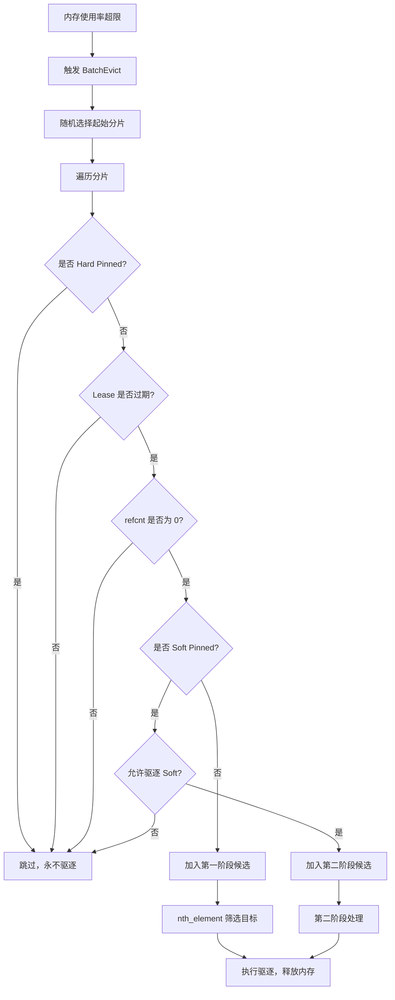

## 4.3 热点保护（Pin 机制）

在 Mooncake Store 中，Lease（租约）和 Pin（锁定）是内存生命周期管理的核心机制，用于控制 KVCache 对象在内存紧张时是否被驱逐（Evict），确保数据在不同访问阶段的安全性。

```cpp
// master_service.h:621-626 - ObjectMetadata 中的三个关键字段
mutable std::chrono::system_clock::time_point lease_timeout
    GUARDED_BY(lock);  //Lease 超时时间
mutable std::optional<std::chrono::system_clock::time_point>
    soft_pin_timeout GUARDED_BY(lock);  // Soft Pin 超时时间
const bool hard_pinned{false};          // Hard Pin
```

### 4.3.1 Lease（租约）：短期保护

- 作用：防止对象在读取时被删除/驱逐
  - 当 Client 调用 GetReplicaList（查询对象位置）时，Master 会自动为该对象续期 Lease。
    
    ```cpp
        auto MasterService::GetReplicaList(const std::string& key) {
            // ... 查找元数据 ...
            
            // 核心动作：授予租约和软锁
            // default_kv_lease_ttl_: 租约时长（如 10s）
            // default_kv_soft_pin_ttl_: 软锁时长（如 5min）
            metadata.GrantLease(default_kv_lease_ttl_, default_kv_soft_pin_ttl_);
            
            return GetReplicaListResponse(...);
        }

        // mooncake-store/include/master_service.h:757-768
        void GrantLease(const uint64_t ttl, const uint64_t soft_ttl) const {
            SpinLocker locker(&lock); // 多个客户端可能同时访问同一个对象，且GrantLease 可能与驱逐线程并发执行
            std::chrono::system_clock::time_point now = std::chrono::system_clock::now();
            lease_timeout = std::max(lease_timeout, now + std::chrono::milliseconds(ttl));
            if (soft_pin_timeout) {
                soft_pin_timeout = std::max(*soft_pin_timeout,
                            now + std::chrono::milliseconds(soft_ttl));
            }
        }
    ```
  - 每个 ObjectMetadata 都有一个 lease_timeout 时间戳。
  - 每次续期会将 lease_timeout 更新为 当前时间 + TTL。
  - 在 BatchEvict（批量驱逐）时，如果 lease_timeout 还没过期，该对象绝对不会被驱逐。

### 4.3.2 Pin（锁定）：中长期保护

Pin 分为两种：Soft Pin（软锁定） 和 Hard Pin（硬锁定）。
#### Soft Pin（软锁定）：中期保护
- 作用：保护热点数据。刚刚被读取的对象在未来短时间内被再次读取的概率很高（时间局部性），Soft Pin 防止它们被立即驱逐，提高缓存命中率。

- 触发时机：
  - 与 Lease 同时触发。在 GrantLease 时，除了设置 lease_timeout，还会设置 soft_pin_timeout。
  - Soft Pin 的 TTL 通常比 Lease 长（例如 Lease 是 10s，Soft Pin 是 5min）。

- 实现机制：
  - ObjectMetadata 中有 soft_pin_timeout 字段。
  - 驱逐优先级低：在 BatchEvict 中，Master 会优先驱逐没有 Soft Pin 的对象。只有当内存极度紧张（第一阶段驱逐不够）且配置允许时，才会驱逐 Soft Pin 对象。
  
  - 代码位置：master_service.cpp:3580 (BatchEvict 第二阶段)
    
    ```cpp
    if (allow_evict_soft_pinned_objects_) {
        // 只有在这里才会考虑驱逐 Soft Pin 对象
        soft_pin_objects.push_back(...);
    }
    ```

#### Hard Pin（硬锁定）：永久保护
- 作用：保护关键数据（如模型权重、系统配置等），无论内存多紧张，都不会被驱逐。

- 触发时机：
  - 在对象创建时（PutStart）通过配置指定。
- 实现机制：
  - ObjectMetadata 中有一个 const bool hard_pinned{false} 字段。
  - 在 BatchEvict 中，一旦检测到 IsHardPinned() 为 true，直接跳过该对象，绝不驱逐。

```cpp
// mooncake-store/include/master_service.h:782-795
bool IsSoftPinned() const {
    SpinLocker locker(&lock);
    return soft_pin_timeout && 
           std::chrono::system_clock::now() < *soft_pin_timeout;
}

bool IsHardPinned() const { return hard_pinned; }
```


## 4.3 分层存储与驱逐策略

分层存储系统通过水位线触发的批量驱逐（BatchEvict）机制维持内存平衡。该机制基于 Lease 过期时间与 Pin 状态区分数据冷热，利用 `nth_element` 算法快速筛选驱逐目标，并结合磁盘后端的 FIFO/LRU 策略，实现 DRAM、SSD 与共享存储间的自动化数据流转，在有限资源下最大化缓存命中率。

### 4.3.1 透明分级链路

```
VRAM/HBM → DRAM → SSD/NVMe → 共享存储
   │          │        │          │
   │          │        │          └─ 3FS/NFS 共享存储
   │          │        └─ 磁盘后端 (StorageBackend)
   │          └─ 内存池 (BufferAllocator)
   └─ GPU 显存 (GPUDirect RDMA)
```

### 4.3.2 内存驱逐机制（BatchEvict）

当内存使用率超过高水位线（如 90%）时，Master 必须主动驱逐部分 KVCache 对象，释放空间给新请求。驱逐策略需要在"释放足够空间"和"保护热点数据"之间取得平衡：驱逐太少会导致后续分配失败，驱逐太多会降低缓存命中率。

**核心流程**：

`BatchEvict()` 采用两阶段驱逐策略，按对象的热度分级处理：

1. **驱逐条件筛选**：
   
   - 必须是内存副本（`is_memory_replica()`），磁盘副本不占用 DRAM，无需驱逐。
   - 必须已完成写入（`is_completed()`），正在写入的副本不能驱逐。
   - 引用计数为零（`refcnt == 0`），没有 Client 正在读取的副本才能驱逐。

2. **随机起始分片**：
   
   - `start_idx = rand() % kNumShards` 随机选择起始分片，避免总是从分片 0 开始遍历，导致分片间驱逐不均衡。

3. **第一阶段驱逐（冷数据）**：
   
   - 遍历所有分片，收集满足以下条件的对象：
     - 非 Hard-pinned（永不驱逐）
     - Lease 已过期（无活跃读取）
     - 非 Soft-pinned（无热点保护）
   - 使用 `nth_element` 计算 lease 超时时间阈值，淘汰lease_timeout低于阈值的对象。

4. **第二阶段驱逐（温数据）**：
   
   - 如果第一阶段驱逐的数量不足 `evict_ratio_target`，且 `allow_evict_soft_pinned_objects_` 为 true，则开始驱逐 Soft-pinned 对象。
   - Soft-pinned 对象是近期访问过的热点数据，驱逐它们会降低缓存命中率，因此在内存紧张时才会考虑。

**关键设计点**：

- **`nth_element` 优化**：相比完全排序（`std::sort`，O(N log N)），`nth_element` 只需找到第 N 小的元素（O(N)），显著降低驱逐算法的时间复杂度。
- **批量驱逐**：一次 `BatchEvict()` 驱逐多个对象，而不是逐个驱逐。这减少了锁的获取次数和元数据更新开销。
- **驱逐比例控制**：`evict_ratio_target` 和 `evict_ratio_lowerbound` 控制驱逐的下限和目标值，避免过度驱逐。例如，目标驱逐 10% 的内存，最低驱逐 5%。

```cpp
// mooncake-store/include/master_config.h  
struct MasterConfig {
  // ...
  double eviction_ratio;                    // 驱逐比例
  double eviction_high_watermark_ratio;     // 高水位线
  // ...
};

class MasterServiceConfigBuilder {
  // ...
  bool allow_evict_soft_pinned_objects_ =   // 是否允许驱逐 soft pin
    DEFAULT_ALLOW_EVICT_SOFT_PINNED_OBJECTS;
}
```

**驱逐触发条件**：

```cpp
if (used_ratio > eviction_high_watermark_ratio_ || 
    (need_eviction_ && eviction_ratio_ > 0.0)) {
    BatchEvict(evict_ratio_target, 
               used_ratio - eviction_high_watermark_ratio_);
}
```

- **高水位触发**：当内存使用率超过 `eviction_high_watermark_ratio_`（如 100%）时，立即触发驱逐。
- **主动驱逐**：当 `need_eviction_` 标志被设置（如手动触发）且 `eviction_ratio_ > 0` 时（配置参数，表示目标驱逐比例，它决定了每次触发驱逐时，期望释放多少比例的内存），提前驱逐。

**性能影响**：

驱逐操作持有分片的写锁，会阻塞该分片上的其他操作（如 Get、Put）。因此，`BatchEvict()` 的设计目标是"快速扫描、快速释放锁"。通过 `nth_element` 和批量处理，对系统吞吐影响极小。

```cpp
// mooncake-store/src/master_service.cpp:3440-3639
void MasterService::BatchEvict(double evict_ratio_target,
                               double evict_ratio_lowerbound) {
    // 驱逐条件：memory replica && completed && refcnt == 0
    auto can_evict_replicas = [](const ObjectMetadata& metadata) {
        return metadata.HasReplica([](const Replica& replica) {
            return replica.is_memory_replica() && replica.is_completed() &&
                   replica.get_refcnt() == 0;
        });
    };

    // 随机选择起始分片，避免分片间驱逐不均衡
    size_t start_idx = rand() % kNumShards;

    // 第一阶段：驱逐无 soft pin 且 lease 过期的对象
    for (size_t i = 0; i < kNumShards; i++) {
        // 对当前分片上锁，遍历到下一个分片的时候放锁。
        MetadataShardAccessorRW shard(this, (start_idx + i) % kNumShards);
        // 遍历shard对象
        for (auto it = shard->metadata.begin(); it != shard->metadata.end(); it++) {
            // Hard-pinned 对象永不驱逐
            if (it->second.IsHardPinned()) continue;
            // Lease未过期或不满足can_evict_replicas，不可驱逐
            if (!it->second.IsLeaseExpired(now) || !can_evict_replicas(it->second)) continue;

            if (!it->second.IsSoftPinned(now)) {
                candidates.push_back(it->second.lease_timeout);  // 第一阶段候选
            } else if (allow_evict_soft_pinned_objects_) {
                soft_pin_objects.push_back(it->second.lease_timeout);  // 第二阶段候选
            }
        }
        // 使用 nth_element 选出第 N 小的时间作为阈值（近似 LRU）
        std::nth_element(candidates.begin(), candidates.begin() + (evict_num - 1), 
                        candidates.end());
        // 再次遍历shard的对象
        auto it = shard->metadata.begin();
        while (it != shard->metadata.end()) {
          // 跳过hardpin等不可驱逐的obj
              if (it->second.lease_timeout <= target_timeout) {
                // 执行驱逐
                total_freed_size +=
                    it->second.size *
                    evict_replicas(it->second);  // Erase memory replicas
                // 检查驱逐后，该 Key 是否还有剩余副本（内存或磁盘）
                if (it->second.IsValid() == false) {
                    // 如果没有任何副本了，从 Master 的哈希表中彻底删除该 Key 的元数据
                    it = shard->metadata.erase(it);
                } else {
                    ++it;
                }
                shard_evicted_count++;
            }
        }
    }

    // 第二阶段：若驱逐数量不足，驱逐 soft pin 对象（如果允许）

}
```

**BatchEvict 两阶段驱逐流程**：



