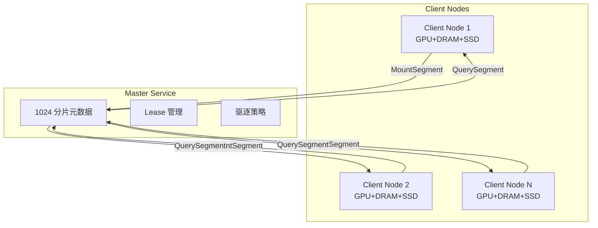

# 四、Mooncake Store：内存池与存储管理

## 4.1 内存池架构与全局命名空间

Master Service 采用 1024 分片架构解决海量元数据的并发访问瓶颈，将全局锁粒度细化至分片级别。配合 `ObjectMetadata` 的多级租约（Lease/Pin）机制，在保障数据一致性的前提下，实现高吞吐的 KVCache 对象查询、状态追踪与生命周期控制，构建起跨越所有节点的统一分布式内存池。



### 4.1.1 Master 分片架构

`MasterService` 采用 1024 个分片（`kNumShards = 1024`），每个分片包含：

```cpp
// mooncake-store/include/master_service.h:841-854
static constexpr size_t kNumShards = 1024;  // 元数据分片数量

std::array<MetadataShard, kNumShards> metadata_shards_;

struct MetadataShard {
    mutable SharedMutex mutex;
    std::unordered_map<std::string, ObjectMetadata> metadata GUARDED_BY(mutex);
    std::unordered_set<std::string> processing_keys GUARDED_BY(mutex);
    std::unordered_map<std::string, const ReplicationTask> replication_tasks GUARDED_BY(mutex);
    std::unordered_map<std::string, const OffloadingTask> offloading_tasks GUARDED_BY(mutex);
};
```

1. **`metadata`**：核心元数据表，存储 `key → ObjectMetadata` 的映射。包括副本列表、租约超时时间、Pin 状态等。
2. **`processing_keys`**：正在处理中的 key 集合，用于防止并发重复写入。当 Client A 正在写入 key "foo" 时，Client B 的写入请求会被拒绝或排队。
3. **`replication_tasks`**：副本复制任务表，跟踪异步复制操作的进度（如从节点 A 复制到节点 B）。
4. **`offloading_tasks`**：磁盘卸载任务表，跟踪从内存卸载到 SSD 的异步任务。

**分片路由算法**：

`getShardIndex(key)` 通过 `std::hash<std::string>(key) % 1024` 计算 key 所属分片索引。

```cpp
// mooncake-store/include/master_service.h:889-891
size_t getShardIndex(const std::string& key) const {
    return std::hash<std::string>{}(key) % kNumShards;
}
```

该算法保证：

- **一致性**：同一个 key 始终路由到同一个分片，避免元数据分散。

- **均匀分布**：`std::hash` 的 avalanche effect 确保 key 均匀分布在 1024 个分片中，避免热点分片。

- **O(1) 查找**：无需遍历，直接计算分片索引。
