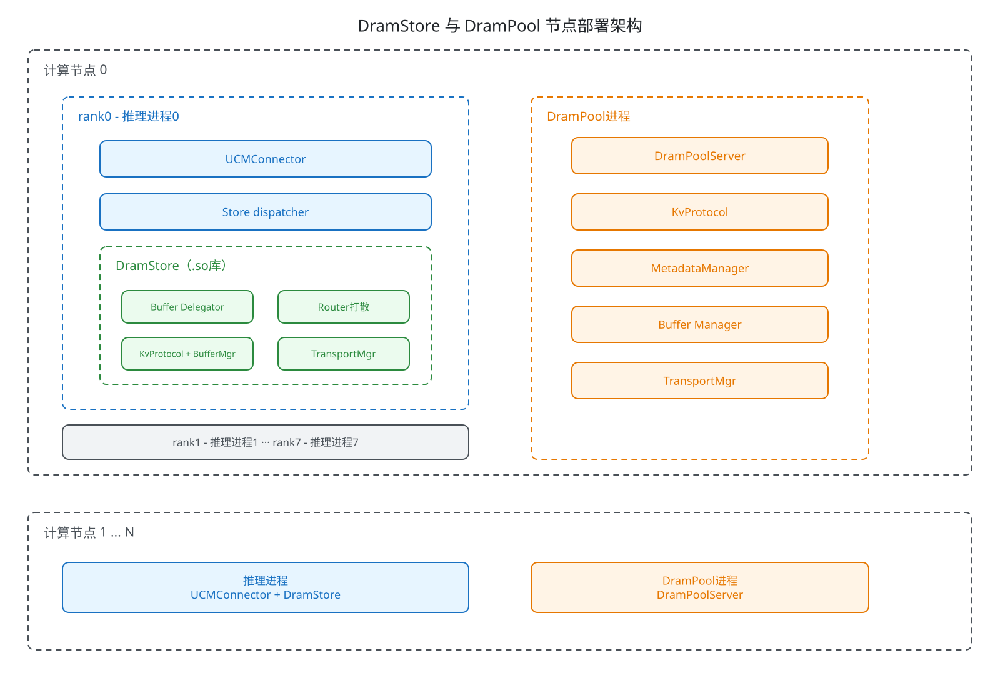
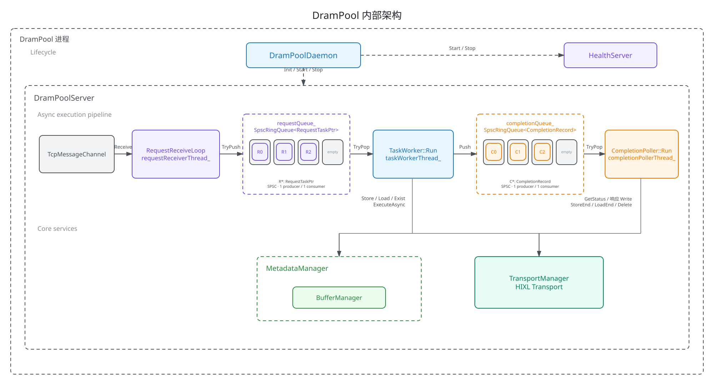
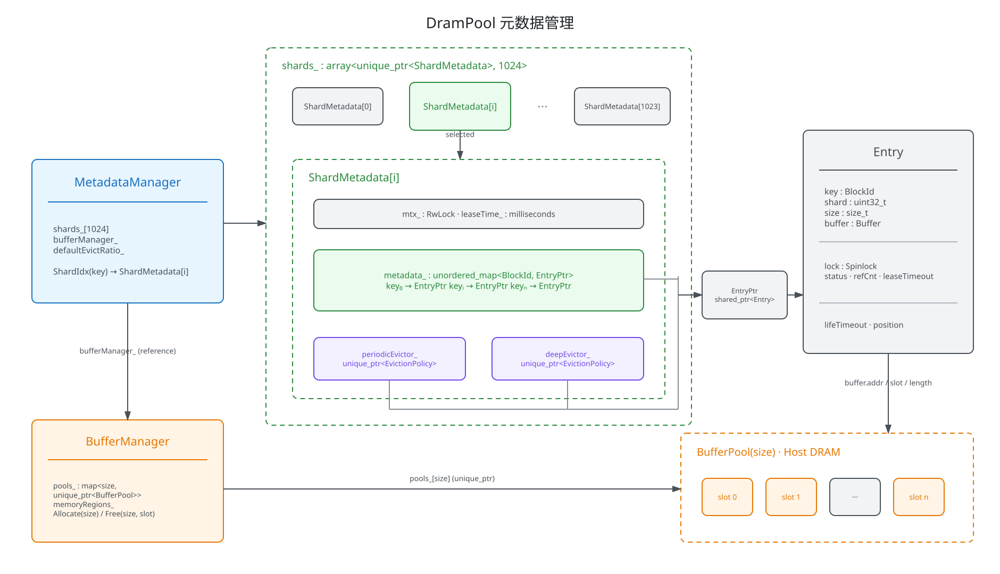
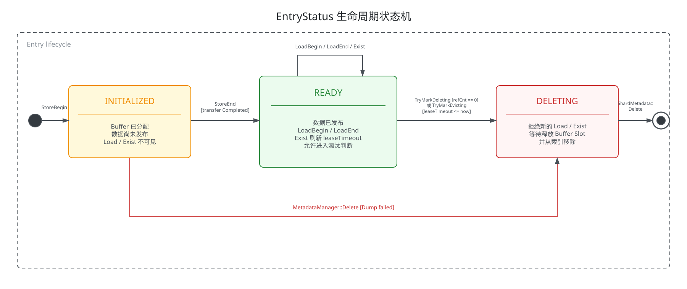
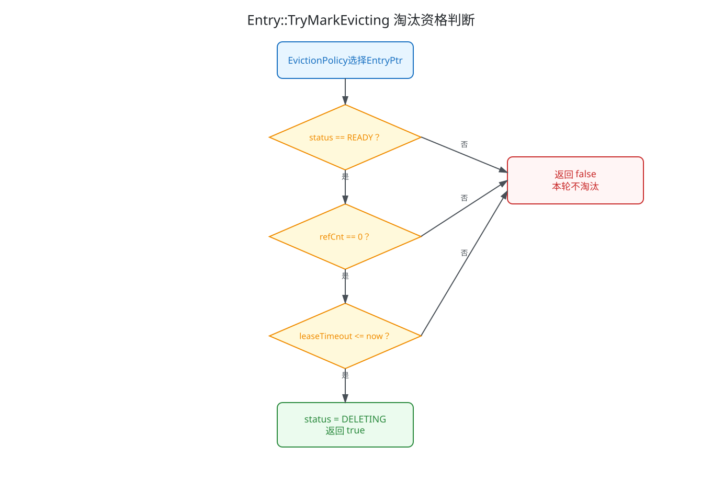
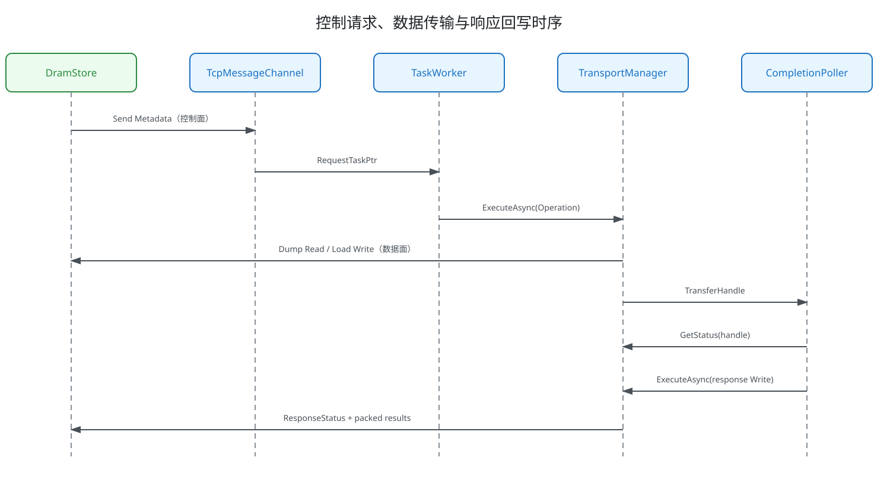
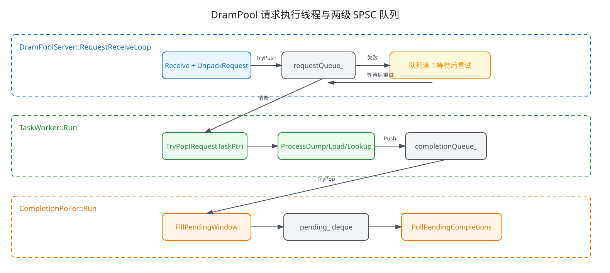
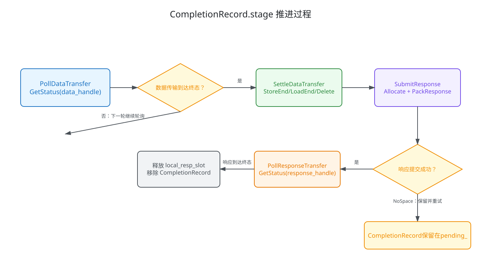

# DramPool 设计方案

## 1. 总体架构

### 1.1 项目背景

当前UCM的实现中，DRAM的有效范围只覆盖了单个推理节点，支持当前节点上的多个推理卡（推理进程）的共享，但不能支持跨节点的推理卡共享，对于集群而言，全局共享必须依赖第三层的全局共享存储实现，不同推理节点上的DRAM会存储相同的KVCache数据，对整集群的DRAM容量造成浪费。同时，PD分离场景下，UCM的PC逻辑只在Prefill实例上生效，实际上Decode实例上的DRAM并没有被有效使用，也对整集群的DRAM容量造成浪费。[1]

### 1.2 节点部署架构



[Excalidraw 源文件](./drampool_constructor_v3.excalidraw)

节点内各组件的边界如下：

| 组件 | 进程形态 | 职责边界 |
| --- | --- | --- |
| DramStore | 推理进程内组件 | 路由 Block、构造协议请求、准备数据地址和响应地址 |
| DramPool | 节点级独立进程 | 管理 Host DRAM、元数据、异步数据传输和响应回写 |

DramPool 中保存的是按固定 Block Size 组织的 KVCache Block。DramStore 可以将一次上层操作拆分到多个 DramPool；单个 DramPool 只处理已经路由到本进程的批量请求，不维护集群 DHT 或全局路由状态。

### 1.3 DramPool 内部架构



[Excalidraw 源文件](./02_internal_architecture_v1.excalidraw)

#### 1.3.1 DramPoolDaemon 进程管理模块

进程管理模块负责把各业务模块组装成可启动、可停止的独立服务，并保证初始化失败或收到退出信号时按照依赖关系释放资源。它不处理具体 Dump、Load、Lookup 语义。

| 类 | 主要职责 | 关键接口 |
| --- | --- | --- |
| `DramPoolDaemon` | 解析配置、初始化日志和信号、组织服务启停 | `Run()`、`SetupLogger()`、`SetupSignals()` |
| `DramPoolServer` | 创建并持有 DramPool 核心模块，管理工作线程 | `Init()`、`Start()`、`Stop()` |
| `HealthServer` | 提供独立 HTTP 健康检查端口 | `Start()`、`Stop()` |

`DramPoolDaemon::Run()` 先完成命令行和 YAML 配置解析，再调用 `DramPoolServer::Init()` 与 `DramPoolServer::Start()`。核心服务启动成功后才启动 `HealthServer`；收到 `SIGINT` 或 `SIGTERM` 后，先停止健康检查，再停止 DramPool 核心服务。

#### 1.3.2 RequestReceiveLoop 请求接入模块

请求接入模块负责把 DramStore 发来的控制报文转换为进程内部可执行的 `RequestTask`。其边界止于 `requestQueue_`：接入线程不分配 KVCache Buffer，也不等待数据传输完成。

| 组件 | 作用 |
| --- | --- |
| `TcpMessageChannel` | 接收携带 KV 协议报文的 `transport::Metadata`； |
| `ProtocolManager` | 根据 `KvOpcode` 选择协议实现，完成请求解包和响应编码 |
| `DramPoolServer::RequestReceiveLoop()` | 接收报文、解析请求、完成 Peer 地址映射并写入 `requestQueue_` |

`RequestReceiveLoop()` 会查询 `g_config.twoSidedToOneSided`。只有配置中存在对应 `two_sided` 地址的 Peer 才能生成 `RequestTask`；未配置的 Peer 会被记录并拒绝，不进入任务队列。

#### 1.3.3 TaskWorker CompletionPoller 请求执行模块

请求执行模块将一次请求拆成“业务提交”和“异步完成”两个阶段。`TaskWorker` 负责生成可执行的数据传输，`CompletionPoller` 负责等待 Transport 终态、收尾元数据并回写最终结果。

| 类 | 阶段 | 主要职责 |
| --- | --- | --- |
| `TaskWorker` | 提交阶段 | 消费 `RequestTask`、操作元数据、构造 `transport::Operation`、调用 `ExecuteAsync()` |
| `CompletionPoller` | 完成阶段 | 轮询 Transfer Handle、执行 `StoreEnd/LoadEnd/Delete`、编码并回写响应 |

两个线程之间使用 `completionQueue_` 传递 `CompletionRecord`。这样 `TaskWorker` 不需要阻塞等待 RDMA/HIXL 操作完成，可以继续处理后续请求；具体线程和队列关系在第 4 章展开。

#### 1.3.4 MetaDataManager 数据与元数据管理模块

数据与元数据管理模块负责一个 `BlockId` 从写入占位、数据发布、加载引用到最终删除的完整生命周期。`BufferManager` 作为 `MetadataManager` 的资源子模块存在：元数据创建时分配 KVCache Slot，元数据删除或淘汰时同步释放 Slot。

| 类 | 职责 |
| --- | --- |
| `MetadataManager` | 根据 Key 路由 Shard，并把 Buffer 分配、释放与元数据操作组合起来 |
| `ShardMetadata` | 维护单个 Shard 的主索引、淘汰策略和并发锁 |
| `Entry` | 保存一个 KVCache Block 的地址、状态、引用和淘汰属性 |
| `BufferManager` | 按 Block Size 管理多个 `BufferPool` |
| `BufferPool` | 管理一个固定 Slot Size 的连续 Host 内存区域 |
| `EvictionPolicy` | 为周期淘汰和深度淘汰选择候选 Entry |

`MetadataManager` 是业务模块访问 KVCache 数据资源的统一入口。`TaskWorker` 和 `CompletionPoller` 不直接释放数据 Slot，而是通过 `MetadataManager::Delete()` 等操作保持主索引和 Buffer 生命周期一致。

#### 1.3.5 TransportManager 数据传输模块

数据传输模块负责控制请求之外的实际单边数据搬运。

| 场景 | `transport::Operation` |
| --- | --- |
| Dump | `Opcode::Read`，`RemoteDeviceHost` |
| Load | `Opcode::Write`，`RemoteDeviceHost` |
| 响应回写 | `Opcode::Write`，`RemoteDeviceHost` |

每个 Operation 都设置 `target_manager`，其值来自请求控制面 Peer 对应的 `peer_one_sided_id`。DramPool 使用 `ExecuteAsync()` 获取 `TransferHandle`，后续由 `CompletionPoller` 调用 `GetStatus()` 推进任务。

### 1.4 GC 数据回收通路

GC 不经过请求队列，它由 `DramPoolServer::GCThreadLoop()` 定期触发：

```text
DramPoolServer::GCThreadLoop
    │ 每隔 g_config.gcIntervalMs
    ▼
MetadataManager::PerformEvict
    │ 遍历 shards_[1024]
    ▼
ShardMetadata::EvictPeriodic
    │ periodicEvictor_->GetEvictionResults(defaultEvictRatio_)
    ▼
Entry::TryMarkEvicting
    │ 成功标记 DELETING
    ▼
BufferManager::Free + ShardMetadata::Delete
```

GC 选择候选和真正释放资源是两个步骤。淘汰策略先返回已经成功转换为 `DELETING` 的 `EntryPtr`，`MetadataManager::EvictOneShard()` 再释放对应 Slot，并从该 Shard 的主索引和两套淘汰策略中删除 Key。

## 2. KVCache 数据组织

### 2.1 元数据管理



[Excalidraw 源文件](./05_metadata_management_v1.excalidraw)

`MetadataManager` 是 DramPool 访问 KVCache 元数据的统一入口。Store、Load、Exist 和 Delete 操作先根据 `BlockId` 路由到 `shards_[1024]` 中的一个 `ShardMetadata`，Buffer 的分配与释放则统一交给 `bufferManager_`。

每个 `ShardMetadata` 独立维护主索引和两套淘汰索引，三者通过 `EntryPtr` 共享同一个 `Entry`。`Entry` 保存元数据状态和 Buffer 定位信息，实际 Host DRAM Slot 由 `BufferManager` 下按 Size 划分的 `BufferPool` 持有。

#### 2.1.1 MetadataManager 对外接口

| 接口 | 用途 | 成功结果 | 失败或可见性 |
| --- | --- | --- | --- |
| `StoreBegin()` | 创建 Entry 并分配 Buffer | Entry 进入目标 Shard，状态为 `INITIALIZED` | 任一步失败都会回滚已分配资源和已建立索引 |
| `StoreEnd()` | 发布写入完成的数据 | Entry 转为 `READY` | Key 不存在或状态不合法时失败 |
| `LoadBegin()` | 获取可加载的 Entry | 返回 Entry，`refCnt + 1` | 非 `READY` Entry 对 Load 不可见 |
| `LoadEnd()` | 结束一次 Load | `refCnt - 1` | Entry 非 `READY` 或引用计数为 0 时失败 |
| `Exist()` | 判断数据是否可用 | 命中并刷新 `leaseTimeout` | Key 不存在或 Entry 非 `READY` 时返回未命中 |
| `Delete()` | 删除 Entry 及其 Buffer | 释放 Slot，并清理主索引和两套淘汰索引 | 存在在途 Load 引用时不能删除 |

#### 2.1.2 StoreBegin 资源一致性

`StoreBegin()` 按照以下顺序建立 Buffer 和元数据索引：

```text
计算 Shard
  → BufferManager::Allocate
  → ShardMetadata::StoreBegin
      → periodicEvictor_->AddKey
      → deepEvictor_->AddKey
      → metadata_.emplace
```

任一步失败都会回滚此前已经完成的步骤。例如深度淘汰策略插入失败时，先从周期淘汰策略删除 Key；Shard 插入整体失败时，`MetadataManager` 再释放刚分配的 Slot。因此调用方不会观察到只有 Buffer、没有元数据，或只进入部分索引的 Entry。

### 2.2 固定大小内存池

#### 2.2.1 内存组织

DramPool 不使用通用变长分配器。启动参数 `--kvcache-block-sizes` 定义可接受的 Block Size 集合，每一种 Size 对应一个独立 `BufferPool`；`--kvcache-block-proportions` 定义总容量在各规格之间的分配比例。内存布局：

```text
BufferManager::pools_

key = S0 bytes                         key = S1 bytes
┌───────────────────────────────┐      ┌───────────────────────────────┐
│ BufferPool("buffer_pool_S0")  │      │ BufferPool("buffer_pool_S1")  │
├─────────┬─────────┬───────────┤      ├─────────┬─────────┬───────────┤
│ Slot 0  │ Slot 1  │ ...       │      │ Slot 0  │ Slot 1  │ ...       │
│ S0 byte │ S0 byte │           │      │ S1 byte │ S1 byte │           │
└─────────┴─────────┴───────────┘      └─────────┴─────────┴───────────┘
```

`BufferPool` 使用 `MemoryType::HOST` 初始化。每个 Pool 对应一段连续 Host 内存，DramPool 启动 Transport 时将这些区域注册为 `transport::MemoryType::Host`，随后 Dump/Load Operation 直接使用 Slot 的 `local_addr`。

#### 2.2.2 BufferManager

`BufferManager` 持有 `unordered_map<size_t, unique_ptr<BufferPool>> pools_`，Map Key 就是协议项中的 `len`。因此一次 Dump 只能分配与配置尺寸完全相同的 Slot，不会选择“更大的 Pool”容纳较小数据。

| 接口 | 输入 | 输出或效果 | 失败语义 |
| --- | --- | --- | --- |
| 构造函数 | `(slotSize, slotNum)` 列表 | 创建每个 Size 对应的 `BufferPool` | 任一 Pool 初始化失败时抛出异常，Server 初始化失败 |
| `GetPool(size)` | Block Size | 对应 `BufferPool*` | 未配置该 Size 时返回 `nullptr` |
| `Allocate(size, Buffer&)` | Block Size | 填充 `Buffer.addr/slot/length` | 未配置 Size 返回 `NotFound`，无空闲 Slot 返回底层状态 |
| `Free(size, slot)` | Block Size、Slot 编号 | 将 Slot 归还对应 Pool | Size 未配置或 Slot 非法时返回失败 |
| `MemoryRegions()` | 无 | 所有 Pool 的 Host Memory Region | 供 `DramPoolServer` 注册内存 |

`Buffer` 本身不拥有内存，只描述一次分配结果：

```cpp
struct Buffer {
    std::uint32_t slot;
    std::size_t length;
    void* addr;
};
```

KVCache Slot 的所有权与元数据绑定。`MetadataManager::StoreBegin()` 先分配 Slot，再把 Entry 插入目标 Shard；插入失败会立即释放 Slot。删除路径则先将 Entry 标记为 `DELETING`，再释放 Slot，最后从 Shard 中移除索引。

### 2.3 Entry

#### 2.3.1 数据结构

`Entry` 是单个 KVCache Block 的运行时实体，主索引和两套淘汰策略都引用同一个 `EntryPtr`。它的字段按可变性可分为不可变属性和受自旋锁保护的运行时属性。

| 字段 | 类型 | 创建后的可变性 | 含义 |
| --- | --- | --- | --- |
| `key` | `BlockId` | 不变 | 16 字节 KVCache Block 标识 |
| `shard` | `uint32_t` | 不变 | `MetadataManager` 计算出的 Shard 编号 |
| `size` | `size_t` | 不变 | Block Size，同时用于选择 BufferPool |
| `buffer` | `Buffer` | 不变 | 本地 Host 地址和 Slot 信息 |
| `lifeTimeout` | `time_point` | 不变 | Entry 的绝对生命周期终点 |
| `position` | `uint32_t` | 不变 | Block 在推理请求中的绝对位置 |
| `refCnt` | `uint32_t` | 可变，受 `lock` 保护 | 正在进行的 Load 引用数 |
| `leaseTimeout` | `time_point` | 可变，受 `lock` 保护 | Lookup 命中后的短期淘汰保护终点 |
| `status` | `EntryStatus` | 可变，受 `lock` 保护 | `INITIALIZED/READY/DELETING` |

`EntryPtr` 定义为 `shared_ptr<Entry>`。Shard 主索引拥有一份引用；在途 Load、淘汰候选或完成处理可以临时持有其他引用，因此从主索引删除 Entry 不会让仍在执行的代码立即访问悬空对象。

#### 2.3.2 状态机



[Excalidraw 源文件](./04_entry_state_v1.excalidraw)

三个状态的语义如下：

| 状态 | Buffer | Lookup | Load | 淘汰 |
| --- | --- | --- | --- | --- |
| `INITIALIZED` | 已分配，数据可能仍在写入 | 不命中 | 不允许 | 不参与策略淘汰 |
| `READY` | 数据完整 | 命中并刷新 Lease | 允许，成功后增加 `refCnt` | 满足保护条件时可淘汰 |
| `DELETING` | 即将或已经释放 | 不命中 | 不允许 | 不会重复选择 |

状态转换由 `Entry` 的原子语义方法完成，每个方法内部持有 `SpinLockGuard`：

- `TryMarkReady()`：只允许 `INITIALIZED → READY`。
- `TryMarkHit(timeout)`：只有 `READY` 才更新 `leaseTimeout`。
- `TryIncRef()`：只有 `READY` 才增加 `refCnt`。
- `TryDecRef()`：要求状态仍为 `READY` 且 `refCnt > 0`。
- `TryMarkDeleting()`：要求尚未处于 `DELETING` 且 `refCnt == 0`。
- `TryMarkEvicting(now)`：进一步要求状态为 `READY` 且 Lease 已结束。

### 2.4 ShardMetadata

Shard 路由规则固定为：

```cpp
BlockIdHasher{}(key) % MetadataManager::kShardCnt
```

其中 `kShardCnt == 1024`。路由结果在 `StoreBegin()` 时写入 `Entry::shard`，实际查找操作仍通过 Key 重新计算 Shard。

每个 `ShardMetadata` 包含：

| 成员 | 数据结构 | 所有权/作用 |
| --- | --- | --- |
| `metadata_` | `unordered_map<BlockId, EntryPtr>` | 主索引，持有 Entry 共享所有权 |
| `periodicEvictor_` | `unique_ptr<EvictionPolicy>` | 后台周期回收使用的候选索引 |
| `deepEvictor_` | `unique_ptr<EvictionPolicy>` | 内存不足时深度回收使用的候选索引 |
| `mtx_` | `RwLock` | 保护主索引和淘汰策略的一致性 |
| `leaseTime_` | `milliseconds` | Lookup 命中时追加的 Lease 时长 |

Shard 的结构性修改使用 `ReadWriteGuard`，查询或只修改 Entry 内部状态的操作使用 `ReadOnlyGuard`。Entry 自己再用 `Spinlock` 保护 `status/refCnt/leaseTimeout`，形成“Shard 锁保护容器，Entry 锁保护对象状态”的两级并发控制。

### 2.5 淘汰策略

`ShardMetadata` 同时维护 `periodicEvictor_` 和 `deepEvictor_`。当前配置允许二者分别选择 TTL 或 Position，默认周期策略为 TTL、深度策略为 Position。

#### 2.5.1 TTL 淘汰策略

`TtlEvictionPolicy` 使用按 `Entry::lifeTimeout` 升序排列的 `multiset`。扫描从最早过期的 Entry 开始，遇到第一个尚未到期的 Entry 即结束；因此它选择的是“所有当前已经过期且能够成功标记”的 Entry，不使用 `evict_ratio` 限制数量。

Dump 请求中的 `ttl` 不为 0 时，以当前系统时间加请求 TTL 得到 `lifeTimeout`；`ttl == 0` 时使用 `g_config.defaultDumpTtlMs`。生命周期是写入时确定的绝对过期时间，Lookup 命中不会延长它。

#### 2.5.2 Position 淘汰策略

`PosEvictionPolicy` 按 `position` 降序排列 Entry，相同位置再按 `lifeTimeout` 升序排列。候选目标数按下式计算：

```text
target = max(1, floor(entries_.size() × evict_ratio))
```

当 `evict_ratio == 0` 或索引为空时不选择候选。扫描过程中，未通过 `TryMarkEvicting()` 的 Entry 会被跳过，直到达到目标数或遍历结束。

#### 2.5.3 淘汰保护



[Excalidraw 源文件](./09_gc_eviction_decision_v1.excalidraw)

`lifeTimeout` 决定 TTL 策略是否把 Entry 送入资格检查，`leaseTimeout` 则是在 Entry 已成为策略候选后提供短期保护。这两个时间语义不同：前者表示数据生命周期，后者表示最近命中后的暂缓淘汰窗口。

#### 2.5.4 淘汰触发方式

| 触发方 | 调用路径 | 使用策略 | 触发条件 |
| --- | --- | --- | --- |
| `GCThreadLoop()` | `PerformEvict()` → `EvictOneShard()` | `periodicEvictor_` | 每隔 `gcIntervalMs` 遍历全部 Shard |
| `StoreBegin()` 第一次重试 | `EvictOneShard(random shard)` | `periodicEvictor_` | `BufferManager::Allocate()` 返回 `NoSpace` |
| `StoreBegin()` 第二次重试 | `EvictOneShard(random shard, true)` | `deepEvictor_` | 普通淘汰后仍然 `NoSpace` |

内存不足路径当前随机选择一个 Shard，并不会按目标 Block Size 定位一定存在可回收 Slot 的 Shard。因此淘汰成功不等价于本次 Size 对应的 BufferPool 一定获得空闲 Slot，代码会在每轮淘汰后再次调用 `Allocate()` 进行确认。

## 3. 通信与协议

### 3.1 通信模型

DramPool 与 DramStore 的通信分成控制请求、KVCache 数据传输和响应回写三个阶段。控制请求负责传递 Opcode、BlockId、远端数据地址和远端响应地址；数据面和响应面由 DramPool 主动发起单边操作。



[Excalidraw 源文件](./06_communication_sequence_v1.excalidraw)

三类操作的数据行为如下：

| 操作 | 控制请求 | KVCache 数据面 | 响应面 |
| --- | --- | --- | --- |
| Dump | TCP Metadata | `Read`：远端 Device → 本地 Host | `Write`：本地 Flag Buffer → 远端响应 Slot |
| Load | TCP Metadata | `Write`：本地 Host → 远端 Device | `Write`：本地 Flag Buffer → 远端响应 Slot |
| Lookup | TCP Metadata | 无 | `Write`：本地 Flag Buffer → 远端响应 Slot |

Dump/Load 的数据 Operation 可以包含多个 `transport::Segment`，从而用一个 `TransferHandle` 表示一个请求中所有可执行项。响应始终按请求维度回写一次，并携带完整的逐项结果。

### 3.2 Endpoint 与连接关系

运行时 YAML 中的每个 Endpoint 项同时配置控制面地址和数据面地址：

```yaml
transport:
  endpoints:
    - two_sided: "127.0.0.1:9000"
      one_sided: "127.0.0.1:4501"
```

二者被解析为：

```cpp
std::unordered_map<std::string, transport::ManagerID> twoSidedToOneSided;
```

| 配置字段 | 用途 |
| --- | --- |
| `two_sided` | TCP Message Channel 的控制面身份，格式为 `IP:PORT` |
| `one_sided` | HIXL/TransportManager 使用的数据面 `ManagerID` |
| `twoSidedToOneSided` | 根据控制面连接来源找到后续 Operation 的目标 Manager |

该映射有两个使用方向：

1. 服务启动时，用 `g_config.addr.ToString()` 查找本地 `one_sided` 地址，以此构造 `TransportManager` 并配置 HIXL Client。
2. 接收请求时，用 `controlPeer.ToString()` 查找对端 `peer_one_sided_id`，随后写入 `RequestTask` 和 `CompletionRecord`。

配置解析会保证每个 Endpoint 同时包含 `two_sided` 和 `one_sided`，并拒绝重复地址。`RequestReceiveLoop()` 中也存在运行时检查：如果 `controlPeer` 不在 `twoSidedToOneSided` 中，请求会被拒绝，不会写入 `requestQueue_`。

### 3.3 Dump 请求与响应

#### 3.3.1 请求格式

Dump 请求由 15 字节请求头和 `batch_size` 个 32 字节 Entry 组成。

| 请求头偏移 | 长度 | 字段 | 说明 |
| ---: | ---: | --- | --- |
| 0 | 1 | `opcode` | `KvOpcode::Dump` |
| 1 | 8 | `resp_addr` | DramStore 响应 Slot 的远端地址 |
| 9 | 4 | `ttl` | 本次 Dump 的生命周期；0 表示使用服务端默认值 |
| 13 | 2 | `batch_size` | Entry 数量 |

每个 Dump Entry 的布局为：

| Entry 内偏移 | 长度 | 字段 | 说明 |
| ---: | ---: | --- | --- |
| 0 | 16 | `key` | `BlockId` |
| 16 | 8 | `addr` | DramStore 侧 Device 数据地址 |
| 24 | 4 | `len` | 数据长度，同时选择 BufferPool |
| 28 | 4 | `idx` | Block 的绝对位置 |

```text
Dump request
┌────────┬───────────┬──────┬────────────┬────────────────┬────────────────┐
│ opcode │ resp_addr │ ttl  │ batch_size │ entry[0]       │ ...            │
│ 1 B    │ 8 B       │ 4 B  │ 2 B        │ 32 B           │                │
└────────┴───────────┴──────┴────────────┴────────────────┴────────────────┘
```

#### 3.3.2 响应格式

当前代码中的响应状态头是 **1 字节**：`ResponseStatus` 的底层类型为 `std::uint8_t`，`kResponseStatusOffset == 0`，`kResponseResultsOffset == 1`。DramStore 的 `ReplyService` 轮询第 0 字节，当值由 `Pending(0)` 变为 `Ready(1)` 后，再解码后续结果。

> 大纲批注中提到“预留 4 字节 status”，但当前 `kv_protocol.h/cc` 并未实现 4 字节预留。本设计按现有代码记录为 1 字节；如果协议需要固定 4 字节头，需要同步修改协议常量、编解码和两端测试。

Dump 的每项结果占 4 bit，一个字节容纳两个结果：

```text
Byte 0                         Byte 1                    Byte 2
┌──────────────────────────┐  ┌────────────┬──────────┐ ┌────────────┬──────────┐
│ ResponseStatus           │  │ result[1]  │ result[0]│ │ result[3]  │ result[2]│
│ Pending=0 / Ready=1      │  │ high 4 bit │ low 4 bit│ │ high 4 bit │ low 4 bit│
└──────────────────────────┘  └────────────┴──────────┘ └────────────┴──────────┘
```

`DumpLoadResult::Ok == 0`，`DumpLoadResult::Failed == 1`，其余 4 bit 取值留作扩展。响应总长度为：

```text
1 + ceil(batch_size / 2) bytes
```

### 3.4 Load 请求与响应

Load 请求没有 TTL 字段，请求头长度为 11 字节；Entry 仍为 32 字节，布局与 Dump Entry 相同。

| 请求头偏移 | 长度 | 字段 |
| ---: | ---: | --- |
| 0 | 1 | `opcode = KvOpcode::Load` |
| 1 | 8 | `resp_addr` |
| 9 | 2 | `batch_size` |

| Entry 内偏移 | 长度 | 字段 |
| ---: | ---: | --- |
| 0 | 16 | `key` |
| 16 | 8 | `addr` |
| 24 | 4 | `len` |
| 28 | 4 | `idx` |

当前 DramPool 的 Load 流程不使用 `KvLoadEntry::idx` 参与元数据查询或传输地址计算，但协议仍保留该字段，使 Dump 和 Load Entry 采用统一的 32 字节布局。

Load 响应与 Dump 完全相同：第 0 字节为 `ResponseStatus`，后续每项结果占 4 bit，`0` 表示成功、`1` 表示失败，其余值预留。

### 3.5 Lookup 请求与响应

Lookup 请求头同样为 11 字节，每个 Entry 只包含 16 字节 `BlockId`：

| 区域 | 偏移 | 长度 | 字段 |
| --- | ---: | ---: | --- |
| Header | 0 | 1 | `opcode = KvOpcode::Lookup` |
| Header | 1 | 8 | `resp_addr` |
| Header | 9 | 2 | `batch_size` |
| Entry | 0 | 16 | `key` |

Lookup 每项结果占 1 bit，一个字节容纳八个 Key 的命中状态：

```text
Byte 0                      Byte 1
┌───────────────────────┐  ┌───┬───┬───┬───┬───┬───┬───┬───┐
│ ResponseStatus        │  │ r7│ r6│ r5│ r4│ r3│ r2│ r1│ r0│
└───────────────────────┘  └───┴───┴───┴───┴───┴───┴───┴───┘
```

`LookupResult::NotFound == 0`，`LookupResult::Exists == 1`，响应总长度为：

```text
1 + ceil(batch_size / 8) bytes
```

返回值是与请求 Key 一一对应的 Bitmap，而不是最长前缀长度。最长前缀如果是上层所需语义，应由 DramStore 或上层调度根据逐项结果计算。

## 4. 请求执行框架

### 4.1 线程模型

`DramPoolServer` 为核心处理链路创建四个线程：

| 线程成员 | 执行入口 | 输入 | 输出 |
| --- | --- | --- | --- |
| `requestReceiverThread_` | `RequestReceiveLoop()` | TCP 控制报文 | `requestQueue_` |
| `taskWorkerThread_` | `TaskWorkerLoop()` → `TaskWorker::Run()` | `RequestTaskPtr` | Transport Operation、`completionQueue_` |
| `completionPollerThread_` | `CompletionPollerLoop()` → `CompletionPoller::Run()` | `CompletionRecord` | 元数据终态、远端响应 |
| `gcThread_` | `GCThreadLoop()` | 定时器 | 淘汰 Entry、释放 KVCache Slot |

`HealthServer` 还维护自己的监听线程，但它不进入 KVCache 请求处理链路。主线程停留在 `DramPoolDaemon::WaitForShutdown()`，只负责等待退出信号。



[Excalidraw 源文件](./07_request_execution_pipeline_v1.excalidraw)

### 4.2 RequestReceiver

`RequestReceiver` 不是独立类，其实现位于 `DramPoolServer::RequestReceiveLoop()`。该线程完成从网络报文到 `RequestTask` 的全部接入工作：

```text
等待 TcpMessageChannel Ready
  → Receive(controlPeer, received)
  → ProtocolManager::UnpackRequest
  → twoSidedToOneSided.find(controlPeer)
  → 构造 RequestTask
  → requestQueue_.TryPush
```

`RequestTask` 同时保存业务请求和数据面目标：

```cpp
struct RequestTask {
    RequestPtr request;
    transport::ManagerID peer_one_sided_id;
};
```

`requestQueue_` 是从 Receiver 到 TaskWorker 的有界 `SpscRingQueue<RequestTaskPtr>`。队列深度由 `g_config.requestQueueDepth` 配置；当 `TryPush()` 失败时，Receiver 不丢弃已经解析完成的请求，而是每隔 `requestReceiverIdleWaitUs` 重试，并只在首次发现队列满时记录一次告警。

这种等待会把背压传递到控制面接收线程：TaskWorker 处理速度持续低于请求到达速度时，Receiver 会停留在入队循环，直到队列出现空位或服务开始停止。

### 4.3 TaskWorker

`TaskWorker::Run()` 是单消费者循环。它优先尝试从 `requestQueue_` 取任务；队列为空且没有停止请求时短暂休眠，收到停止请求后会在队列已经排空时退出。

`ProcessOneRequest()` 根据 `request->opcode` 分发到三个处理函数：

| Opcode | 处理函数 | 元数据动作 | 数据 Operation |
| --- | --- | --- | --- |
| `Dump` | `ProcessDump()` | `StoreBegin()`，完成后由 Poller `StoreEnd()` | 批量 `Read` |
| `Load` | `ProcessLoad()` | `LoadBegin()`，完成后由 Poller `LoadEnd()` | 批量 `Write` |
| `Lookup` | `ProcessLookup()` | `Exist()` | 无数据 Operation，直接进入响应阶段 |

TaskWorker 的职责边界是“提交，不等待”。当 Dump/Load 至少有一个 Entry 可以执行时，它构造一个 `transport::Operation`，每个可执行项对应一个 `transport::Segment`，然后调用：

```cpp
runtime_.transport.ExecuteAsync(operation, handle);
```

提交成功后，TaskWorker 创建 `CompletionRecord`，令 `stage = CompletionStage::PollDataTransfer`。如果 Lookup 不需要数据传输，或者 Dump/Load 没有任何可传输项，则直接创建 `stage = CompletionStage::SubmitResponse` 的记录。

TaskWorker 通过 `completionQueue_.Push()` 将记录交给 CompletionPoller。该队列是 `SpscRingQueue<CompletionRecord>`，TaskWorker 是唯一生产者，CompletionPoller 是唯一消费者。

### 4.4 CompletionPoller

CompletionPoller 负责一个异步请求从“数据在途”到“响应写回完成”的全部后半生命周期。它不仅轮询 Transport，还决定何时发布 Dump Entry、何时释放 Load 引用，以及本地响应 Slot 何时可以复用。

#### 4.4.1 CompletionRecord

| 字段 | 所属阶段 | 作用 |
| --- | --- | --- |
| `stage` | 全阶段 | 当前执行到 `PollDataTransfer/SubmitResponse/PollResponseTransfer` 中的哪一步 |
| `data_handle` | 数据传输 | Dump/Load 数据 Operation 的 Handle |
| `transfer_items` | 数据收尾 | 保存请求内参与传输的 `index_in_request` 和 `key` |
| `submit_ms` | 轮询 | 计算本阶段等待时间 |
| `timeout_reported` | 轮询 | 保证同一阶段只记录一次超时 |
| `opcode` | 响应 | 决定结果编码方式和元数据收尾方式 |
| `remote_resp_addr` | 响应 | DramStore 响应 Slot 的远端地址 |
| `peer_one_sided_id` | 传输 | 设置响应 Operation 的 `target_manager` |
| `results` | 响应 | 按原请求下标保存逐项结果 |
| `response_handle` | 响应传输 | 响应 Write 的 Handle |
| `local_resp_slot` | 响应传输 | 保持本地响应源 Buffer 存活到 Write 终态 |

#### 4.4.2 Pending Window

CompletionPoller 不直接在 `completionQueue_` 上等待单个 Handle，而是维护本地 `deque<CompletionRecord> pending_`。`FillPendingWindow()` 每轮从队列取记录，直到 `pending_.size()` 达到 `g_config.pollerPendingDepth` 或队列暂时为空。

`PollPendingCompletions()` 对本轮开始时的 Pending 快照扫描一次：

- Waiting 的记录保留在原位置，下轮继续查询。
- 数据传输刚完成的记录可以在本轮直接进入 `SubmitResponse`，无需额外等待一轮。
- 响应 Write 到达终态后释放 `local_resp_slot` 并移除记录。
- 永久性响应提交失败会释放已有资源并移除记录。
- `flagBufferPool_` 暂时 `NoSpace` 时保留记录，下轮重试。

#### 4.4.3 阶段推进



[Excalidraw 源文件](./08_completion_poller_state_v1.excalidraw)

各阶段的行为如下：

| 阶段 | 核心操作 | 退出条件 |
| --- | --- | --- |
| `PollDataTransfer` | `GetStatus(data_handle)`，调用 `SettleDataTransfer()` | 数据 Handle 为 Completed 或 Failed |
| `SubmitResponse` | 分配 `local_resp_slot`、`PackResponse()`、提交响应 Write | 获得有效 `response_handle`，或发生永久失败 |
| `PollResponseTransfer` | `GetStatus(response_handle)` | 响应 Handle 到达任意终态，随后释放 Slot |

`SettleDataTransfer()` 根据 Opcode 执行不同收尾：

- Dump Completed：调用 `StoreEnd()` 将 Entry 发布为 `READY`。
- Dump Failed：调用 `Delete()` 删除占位 Entry 并释放 Buffer。
- Load Completed/Failed：均调用 `LoadEnd()` 释放引用，只有 Completed 返回成功结果。

当 `GetStatus()` 长时间返回 Waiting 时，`OperationTimedOut()` 只记录诊断日志，不强制删除 Handle 或复用相关 Buffer。记录仍保留在 `pending_` 中，直到 Transport 返回终态。

### 4.5 GCThread

`DramPoolServer::GCThreadLoop()` 在 `g_config.gcEnabled` 为 true 时启动。线程使用 `condition_variable::wait_for()` 等待 `gcIntervalMs`，既能周期唤醒，也能在服务停止时立即被通知退出。

每轮执行：

```cpp
metadataManager_->PerformEvict();
```

`PerformEvict()` 顺序遍历 `shards_[1024]`，对每个 Shard 调用周期淘汰策略。候选 Entry 已经由 `TryMarkEvicting()` 完成状态竞争，因此 GC 在释放 Slot 和删除索引时，不会与新的 Load 引用同时建立。

GCThread 与 TaskWorker 会并发访问 `MetadataManager`，并发安全由 Shard 的 `RwLock` 和 Entry 的 `Spinlock` 提供。GC 不经过 `requestQueue_` 或 `completionQueue_`，也不会生成客户端响应。
