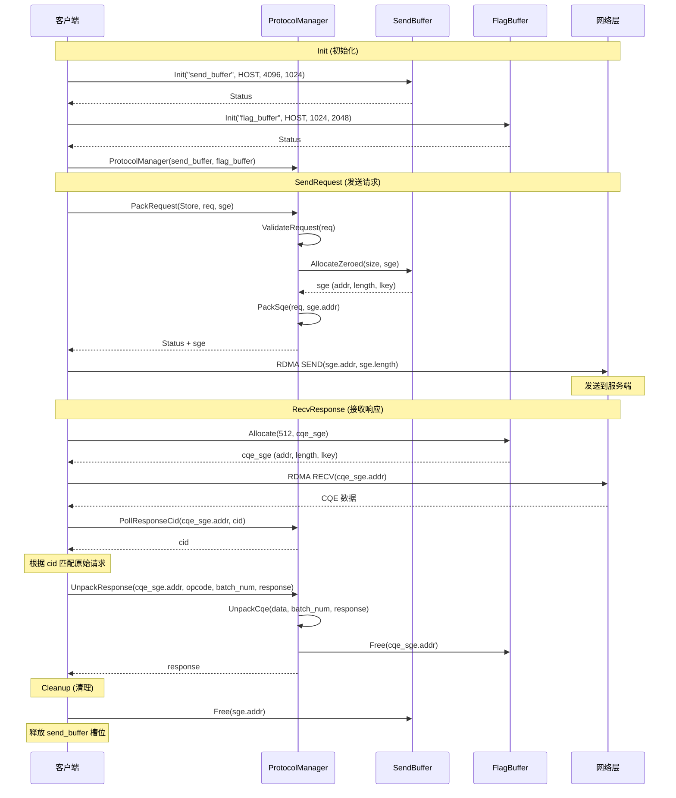

# BufferManager & KvProtocol 设计文档

## 概述

基于 `feature_26h1` 分支的修改，实现了统一的内存管理和 KV 协议编解码框架。主要包含两个核心组件：

- **BufferManager**: 基于 IndexPool 的槽位式内存管理器，支持 HOST、HOST_PINNED、ASCEND_DEVICE 三种内存类型
- **KvProtocol**: 统一的 SQE 打包 / CQE 解包框架，替代原有的 SqeManager 和 CqeManager

---

## 类关系图

```mermaid
classDiagram
    class BufferManager {
        -string name_
        -size_t slot_size_
        -size_t slot_num_
        -MemoryType memory_type_
        -shared_ptr~void~ memory_
        -IndexPool index_pool_
        +Init(string name, MemoryType type, size_t slot_size, size_t slot_num) Status
        +Allocate(size_t size, ScatterGatherEntry& sge) Status
        +AllocateZeroed(size_t size, ScatterGatherEntry& sge) Status
        +Free(void* ptr) Status
        +IsValidPointer(const void* ptr) bool
    }

    class IndexPool {
        -vector~uint32_t~ pool_
        -atomic~uint32_t~ head_
        +Acquire() uint32_t
        +Release(uint32_t index)
    }

    class ScatterGatherEntry {
        +uint64_t addr
        +uint32_t length
        +uint32_t lkey
    }

    class MemoryType {
        <<enumeration>>
        HOST
        HOST_PINNED
        ASCEND_DEVICE
    }

    class KvProtocol {
        <<abstract>>
        +PackSqe(const SqeRequest& req, uint32_t* target) Status
        +PackedSize(const SqeRequest& req) size_t
        +ValidateRequest(const SqeRequest& req) Status
        +UnpackCqe(const uint32_t* data, uint16_t batch_number, KvResponse& out) Status
    }

    class KvStoreProtocol {
        +PackSqe() Status
        +PackedSize() size_t
        +ValidateRequest() Status
    }

    class KvRetrieveProtocol {
        +PackSqe() Status
        +PackedSize() size_t
        +ValidateRequest() Status
    }

    class KvBatchStoreProtocol {
        +PackSqe() Status
        +PackedSize() size_t
        +ValidateRequest() Status
        +UnpackCqe() Status
        -PackEntry()
    }

    class KvBatchRetrieveProtocol {
        +PackSqe() Status
        +PackedSize() size_t
        +ValidateRequest() Status
        +UnpackCqe() Status
        -PackEntry()
    }

    class KvDeleteProtocol {
        +PackSqe() Status
        +PackedSize() size_t
        +ValidateRequest() Status
        +UnpackCqe() Status
        -PackEntry()
    }

    class KvExistProtocol {
        +PackSqe() Status
        +PackedSize() size_t
        +ValidateRequest() Status
        +UnpackCqe() Status
        -PackEntry()
    }

    class KvKeepAliveProtocol {
        +PackSqe() Status
        +PackedSize() size_t
        +ValidateRequest() Status
    }

    class ProtocolManager {
        -BufferManager* send_buffer_
        -BufferManager* flag_buffer_
        -unordered_map~KvOpcode, unique_ptr~KvProtocol~~ protocols_
        +ProtocolManager(BufferManager& send_buffer, BufferManager& flag_buffer)
        +PackedSize(KvOpcode opcode, const SqeRequest& req) size_t
        +PackRequest(KvOpcode opcode, const SqeRequest& req, ScatterGatherEntry& sge) Status
        +UnpackResponse(const void* data_ptr, KvOpcode opcode, uint16_t batch_number, KvResponse& out) Status
        +PollResponseCid(const void* data_ptr, uint16_t& cid) Status
        -GetProtocol(KvOpcode opcode) KvProtocol*
    }

    class SqeRequest {
        <<abstract>>
    }

    class KvStoreRequest {
        +uint16_t cid
        +uint32_t kv_ns_id
        +uint64_t buffer_addr
        +uint32_t buffer_length
        +uint32_t mr_key
        +uint32_t offset
        +bool lr
        +uint32_t length
        +string key
    }

    class KvRetrieveRequest {
        +uint16_t cid
        +uint32_t kv_ns_id
        +uint64_t buffer_addr
        +uint32_t buffer_length
        +uint32_t mr_key
        +uint32_t offset
        +bool lr
        +uint32_t length
        +string key
    }

    class KvBatchStoreRequest {
        +uint16_t cid
        +uint32_t kv_ns_id
        +uint64_t response_buffer_addr
        +uint32_t response_mr_key
        +bool lr
        +bool rflag
        +uint16_t batch_number
        +vector~KvBatchStoreEntry~ entries
    }

    class KvBatchRetrieveRequest {
        +uint16_t cid
        +uint32_t kv_ns_id
        +uint64_t response_buffer_addr
        +uint32_t response_mr_key
        +bool lr
        +bool rflag
        +uint16_t batch_number
        +vector~KvBatchRetrieveEntry~ entries
    }

    class KvDeleteRequest {
        +uint16_t cid
        +uint32_t kv_ns_id
        +uint64_t response_buffer_addr
        +uint32_t response_mr_key
        +bool rflag
        +uint16_t batch_number
        +vector~string~ keys
    }

    class KvExistRequest {
        +uint16_t cid
        +uint32_t kv_ns_id
        +uint64_t response_buffer_addr
        +uint32_t response_mr_key
        +bool rflag
        +bool sc
        +uint16_t batch_number
        +vector~string~ keys
    }

    class KvKeepAliveRequest {
        +uint16_t cid
        +uint64_t response_buffer_addr
        +uint32_t response_mr_key
        +bool rflag
    }

    class KvResponse {
        +uint16_t cid
        +uint16_t status
        +uint16_t existing_key_number
        +vector~uint8_t~ result_buffer
    }

    BufferManager --> IndexPool : 使用
    BufferManager --> MemoryType : 使用
    BufferManager --> ScatterGatherEntry : 输出

    ProtocolManager --> BufferManager : send_buffer_
    ProtocolManager --> BufferManager : flag_buffer_
    ProtocolManager --> KvProtocol : protocols_

    KvProtocol <|-- KvStoreProtocol
    KvProtocol <|-- KvRetrieveProtocol
    KvProtocol <|-- KvBatchStoreProtocol
    KvProtocol <|-- KvBatchRetrieveProtocol
    KvProtocol <|-- KvDeleteProtocol
    KvProtocol <|-- KvExistProtocol
    KvProtocol <|-- KvKeepAliveProtocol

    SqeRequest <|-- KvStoreRequest
    SqeRequest <|-- KvRetrieveRequest
    SqeRequest <|-- KvBatchStoreRequest
    SqeRequest <|-- KvBatchRetrieveRequest
    SqeRequest <|-- KvDeleteRequest
    SqeRequest <|-- KvExistRequest
    SqeRequest <|-- KvKeepAliveRequest

    KvProtocol ..> SqeRequest : 输入
    KvProtocol ..> KvResponse : 输出
```



---

## 使用方法

### 整体流程

```
Init (初始化)
  ├── 1. send_buffer.Init("send_buffer", MemoryType::HOST_PINNED, 4096, 1)
  ├── 2. flag_buffer.Init("flag_buffer", MemoryType::HOST_PINNED, 128, 1024)
  └── 3. ProtocolManager protocol_mgr(send_buffer, flag_buffer)
        ├── send_buffer_ = &send_buffer  // 保存 send_buffer 指针
        ├── flag_buffer_ = &flag_buffer  // 保存 flag_buffer 指针
        └── protocols_ 注册表初始化:
              protocols_[Store]         = KvStoreProtocol()
              protocols_[Retrieve]      = KvRetrieveProtocol()
              protocols_[BatchStore]    = KvBatchStoreProtocol()
              protocols_[BatchRetrieve] = KvBatchRetrieveProtocol()
              protocols_[Delete]        = KvDeleteProtocol()
              protocols_[Exist]         = KvExistProtocol()
              protocols_[KeepAlive]     = KvKeepAliveProtocol()

SendRequest (发送请求)
  ├── 1. 构造 Request 对象 (KvStoreRequest / KvBatchStoreRequest / ...)
  ├── 2. protocol_mgr.PackRequest(opcode, req, sge)
  │     ├── GetProtocol(opcode)
  │     │     └── protocols_[opcode] 查表，返回对应的 KvProtocol* 多态指针
  │     │           KvOpcode::Store         -> KvStoreProtocol
  │     │           KvOpcode::Retrieve      -> KvRetrieveProtocol
  │     │           KvOpcode::BatchStore    -> KvBatchStoreProtocol
  │     │           KvOpcode::BatchRetrieve -> KvBatchRetrieveProtocol
  │     │           KvOpcode::Delete        -> KvDeleteProtocol
  │     │           KvOpcode::Exist         -> KvExistProtocol
  │     │           KvOpcode::KeepAlive     -> KvKeepAliveProtocol
  │     ├── proto->ValidateRequest(req)     // 虚函数调用，校验请求字段
  │     ├── proto->PackedSize(req)          // 虚函数调用，计算打包大小
  │     ├── send_buffer.AllocateZeroed()    // 从 send_buffer 分配槽位并清零
  │     └── proto->PackSqe(req, sge.addr)   // 虚函数调用，打包 SQE 到槽位
  │           失败时自动 send_buffer.Free() 回滚
  └── 3. rdma_send(sge.addr, sge.length)    // 发送 SQE 到服务端

RecvResponse (接收响应)
  ├── 1. flag_buffer.AllocateZeroed(512, cqe_sge)  // 从 flag_buffer 分配槽位
  ├── 2. rdma_recv(cqe_sge.addr)             // 接收 CQE 到槽位
  ├── 3. protocol_mgr.PollResponseCid(cqe_sge.addr, cid)  // 轮询 CID
  │     └── 根据 cid 匹配原始请求
  └── 4. protocol_mgr.UnpackResponse(cqe_sge.addr, opcode, batch_num, response)
        ├── GetProtocol(opcode)
        │     └── protocols_[opcode] 查表，返回对应的 KvProtocol* 多态指针
        │           KvOpcode::BatchStore    -> KvBatchStoreProtocol  (4-bit result)
        │           KvOpcode::BatchRetrieve -> KvBatchRetrieveProtocol (4-bit result)
        │           KvOpcode::Delete        -> KvDeleteProtocol      (1-bit result)
        │           KvOpcode::Exist         -> KvExistProtocol       (1-bit result)
        │           KvOpcode::Store/Retrieve/KeepAlive -> UNSUPPORTED (无 CQE 解包)
        ├── proto->UnpackCqe(data, batch_num, response)  // 虚函数调用，解包 CQE
        └── flag_buffer.Free(cqe_sge.addr)               // 成功后自动释放 flag_buffer 槽位

Cleanup (清理)
  └── send_buffer.Free(sge.addr)  // 释放 send_buffer 槽位
```

### 内存类型说明

| MemoryType      | 说明                    | 适用场景               |
| --------------- | --------------------- | ------------------ |
| `HOST`          | 普通主机内存                | 默认场景，无特殊要求         |
| `HOST_PINNED`   | 锁页主机内存 (mmap + mlock) | 需要 DMA 访问或 RDMA 注册 |
| `ASCEND_DEVICE` | Ascend 设备内存           | NPU 直接访问           |

### 配置建议

```cpp
// SendBuffer 配置
// - 槽位大小: 根据最大 SQE 大小确定 (BatchStore 最大约 4KB)
// - 槽位数量: 根据并发请求数确定
constexpr size_t kSendBufferSlotSize = 4096;
constexpr size_t kSendBufferSlotNum = 1024;

// FlagBuffer 配置
// - 槽位大小: CQE 固定 16 bytes + result_buffer (最大 256*4=1024 bytes)
// - 槽位数量: 通常 >= send_buffer 槽位数
constexpr size_t kFlagBufferSlotSize = 1024;
constexpr size_t kFlagBufferSlotNum = 2048;
```

---

## 使用流程图



---

## 完整示例代码

### 单条操作 (Store)

```cpp
#include "buffer_manager.h"
#include "kv_protocol.h"
#include <iostream>

using namespace UC::ASU;

// === Init ===
BufferManager send_buffer;
send_buffer.Init("send_buffer", MemoryType::HOST, 4096, 1024);

BufferManager flag_buffer;
flag_buffer.Init("flag_buffer", MemoryType::HOST, 1024, 2048);

ProtocolManager protocol_mgr(send_buffer, flag_buffer);

// === SendRequest ===
KvStoreRequest req;
req.cid = 0x1234;
req.kv_ns_id = 1;
req.buffer_addr = 0x10000000;
req.buffer_length = 4096;
req.mr_key = 0xABCD;
req.offset = 0;
req.length = 4096;
req.key = "test_key";

ScatterGatherEntry sge;
Status status = protocol_mgr.PackRequest(KvOpcode::Store, req, sge);
// rdma_send(sge.addr, sge.length, sge.lkey);

// === RecvResponse ===
ScatterGatherEntry cqe_sge;
flag_buffer.Allocate(512, cqe_sge);
// rdma_recv(cqe_sge.addr, cqe_sge.length, cqe_sge.lkey);

uint16_t response_cid = 0;
protocol_mgr.PollResponseCid(reinterpret_cast<void*>(cqe_sge.addr), response_cid);
// 根据 response_cid 匹配原始请求

KvResponse response;
protocol_mgr.UnpackResponse(
    reinterpret_cast<void*>(cqe_sge.addr),
    KvOpcode::Store, 1, response);
// response.cid / response.status / response.result_buffer

// === Cleanup ===
// flag_buffer 槽位已在 UnpackResponse 中自动释放
send_buffer.Free(reinterpret_cast<void*>(sge.addr));
```

### Batch 操作 (BatchStore)

```cpp
// === SendRequest ===
KvBatchStoreRequest batch_req;
batch_req.cid = 0x5678;
batch_req.kv_ns_id = 1;
batch_req.response_buffer_addr = 0x20000000;
batch_req.response_mr_key = 0x1234;
batch_req.batch_number = 3;

for (int i = 0; i < 3; ++i) {
    KvBatchStoreEntry entry;
    entry.offset = i * 4096;
    entry.key = "key_" + std::to_string(i);
    entry.buffer_addr = 0x30000000 + i * 4096;
    entry.mr_key = 0xABCD;
    entry.length = 4096;
    batch_req.entries.push_back(entry);
}

ScatterGatherEntry batch_sge;
protocol_mgr.PackRequest(KvOpcode::BatchStore, batch_req, batch_sge);
// rdma_send(batch_sge.addr, batch_sge.length, batch_sge.lkey);

// === RecvResponse ===
ScatterGatherEntry cqe_sge;
flag_buffer.Allocate(512, cqe_sge);
// rdma_recv(cqe_sge.addr, cqe_sge.length, cqe_sge.lkey);

uint16_t response_cid = 0;
protocol_mgr.PollResponseCid(reinterpret_cast<void*>(cqe_sge.addr), response_cid);

KvResponse batch_response;
protocol_mgr.UnpackResponse(
    reinterpret_cast<void*>(cqe_sge.addr),
    KvOpcode::BatchStore, 3, batch_response);

// batch_response.result_buffer 包含 3 个元素 (4-bit per key)
for (size_t i = 0; i < batch_response.result_buffer.size(); ++i) {
    // 0x0=success, 0x1=retry, 0x2=no_retry, 0x3=not_found, 0x4=data_not_exist
}

// === Cleanup ===
send_buffer.Free(reinterpret_cast<void*>(batch_sge.addr));
```

---

## 关键设计点

### 1. BufferManager 的槽位管理

- 使用 `IndexPool` 进行无锁槽位分配
- 支持 `Allocate` 和 `AllocateZeroed` 两种分配方式
- `Free` 时自动归还槽位到池中
- `IsValidPointer` 用于验证指针是否属于该 BufferManager

### 2. KvProtocol 的多态设计

- `KvProtocol` 是抽象基类，定义统一的接口
- 每种操作类型（Store、Retrieve、BatchStore 等）有对应的实现类
- `ProtocolManager` 内部维护 `KvOpcode -> KvProtocol` 的映射

### 3. 请求验证

- 每种协议实现 `ValidateRequest` 方法
- 在 `PackRequest` 时自动调用验证
- 验证失败时返回详细的错误信息（包含实际值）

### 4. 内存生命周期

- `BufferManager` 使用 `shared_ptr<void>` 管理内存
- 析构时自动释放内存
- 调用者需要显式调用 `Free` 归还槽位

### 5. 错误处理

- 所有操作返回 `Status` 对象
- 错误信息包含上下文（如 buffer 名称、实际值等）
- 使用 `[[unlikely]]` 优化错误路径

---

## 测试覆盖

- **BufferManager 测试**: 19 个测试用例
  
  - 初始化、分配、释放、并发、边界条件等

- **KvProtocol 测试**: 51 个测试用例
  
  - 各种操作类型的打包/解包
  - 请求验证（合法/非法）
  - 边界条件（跨 dword、单 key 等）
  - 端到端集成测试

总计 **70 个测试用例**，全部通过。
