Mooncake调研

# 一、整体架构

Mooncake 采用了一种以 KVCache 为中心的分布式架构，旨在解决大模型推理中显存瓶颈和数据传输延迟的问题。

## 1.1 系统全景图与组件交互

如架构图所示，Mooncake 的整体系统主要由四个核心部分组成：全局调度器（Conductor）、Prefill 资源池、Decoding 资源池以及分布式存储与传输引擎（Mooncake Store & Transfer Engine）。

### 1.1.1 Prefill/Decode 资源池

PD分离设计允许针对两个阶段不同的计算和内存特征进行独立的资源分配和调度优化。

1）Prefill Pool：处理高并发的首词生成（Prefill）阶段。其优化目标是最大化 KVCache 的重用率（max Cache Reuse），同时满足首字延迟（TTFT）的 SLO 要求。每个 Prefill Instance 内部包含 GPU/VRAM 和 CPU/DRAM/SSD，利用 Local Chunked Prefill Scheduler 管理显存内的 Paged KVCache。

2）Decoding Pool：解码阶段。其优化目标是最大化吞吐量（max Throughput），满足 token 生成时间（TBT）的 SLO。Decoding Instance 同样具备多级存储结构，通过 Local Scheduler 调度显存资源。

### 1.1.2 全局 Conductor 调度器

Conductor根据全局视角下发调度指令，不直接参与数据搬运。它包含三个关键组件：

1）Cache-aware Prefill Scheduler：负责为每个请求，选择一个能**最大化复用已缓存KVCache**且**负载最低**的Prefill节点。
2）KVCache Balance Scheduler：通过主动迁移热点KVCache来平衡KVCache在集群中的分布。
3）Load-balance Decoding Scheduler：根据各Decode节点的实时负载情况，选择一个负载最低的节点来处理该请求的解码工作。

### 1.1.3 多级 KV Store 与 Transfer Engine

1）Mooncake Store：是一个跨越所有 Instance 的分布式 KVCache 池。它利用 CPU 的 DRAM 和 SSD 构建了缓存池。
2）KVCache Transfer Engine：位于架构中心，通过 RDMA 连接各个节点的 Distributed KVCache Pool。它负责在实例之间高效地传输 KVCache 数据。

# 二、请求调度策略

调度器（Conductor）的核心目标是：**在严格满足延迟 SLO 的前提下，最大化 KVCache 复用率与集群整体吞吐**。请求调度分为四个阶段：

- 阶段 1：前缀匹配

将请求 Prompt 按固定 Block Size 切分并 Hash 生成 `block_keys`。再扫描全局元数据，找出持有最长公共前缀的实例节点 `best_instance`及其匹配长度 `best_len`。

- 阶段 2：prefill实例选择

遍历所有 Prefill 节点：

- 若 `best_len / instance.prefix_len > threshold`：说明当前节点缓存远少于最优节点，**远程拉取+计算** 比 **全量本地计算** 更快。此时预估传输耗时 `T_transfer`，并按 `best_len`计算剩余 Prefill 计算量（使用通过离线数据拟合的多项式回归模型来估计相应的执行时间）。
- 若比值未超阈值：说明当前节点缓存已足够，**就地计算** 可避免网络开销。此时 `T_transfer = 0`，按本地 `prefix_len`计算剩余 Prefill 计算量。

预估`TTFT = T_transfer(网络) + T_queue(排队) + T_prefill(计算)`。选择预估 TTFT 最小的节点p，并相应地更新该实例的缓存和队列时间。

- 阶段 3：请求拒绝

选定 `p` 后，同步选择负载最轻的 Decode 节点 `d`，并预估token生成间隔 `TBT`。若预估 `TTFT`或 `TBT`超出人工设定的 SLO 阈值，**直接拒绝请求**。避免在系统超载时盲目接纳请求导致雪崩，保障已接受请求的体验。

- 阶段 4：缓存调度

若最终选定的实例并非 `best_instance`，且缓存差距超阈值，Conductor会将缓存的位置和请求转发到目标实例，目标实例主动从缓存持有者处检索KVCache，并拉取缺失的 KVCache。

### 三、Transfer Engine：高性能数据传输

## 3.1 拓扑感知与零拷贝传输

### 3.1.1 拓扑发现流程

Transfer Engine 在初始化时自动发现系统拓扑，构建 CPU/GPU 到 RDMA 网卡的亲和性矩阵：

```cpp
// mooncake-transfer-engine/src/topology.cpp:473-492
int Topology::discover(const std::vector<std::string> &filter) {
    matrix_.clear();
    auto all_hca = listInfiniBandDevices(filter);  // 枚举 IB 设备
    for (auto &ent : discoverCpuTopology(all_hca))  // CPU NUMA 拓扑
        matrix_[ent.name] = ent;
    for (auto &ent : discoverCudaTopology(all_hca))  // GPU PCIe 拓扑
        matrix_[ent.name] = ent;
    return resolve();
}
```

**拓扑发现流程图**：

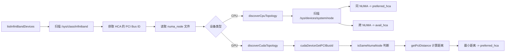

### 3.1.2 CPU NUMA 亲和性实现

```cpp
// mooncake-transfer-engine/src/topology.cpp:303-338
static std::vector<TopologyEntry> discoverCpuTopology(
    const std::vector<InfinibandDevice> &all_hca) {
    DIR *dir = opendir("/sys/devices/system/node");
    while ((entry = readdir(dir))) {
        int node_id = atoi(entry->d_name + strlen("node"));
        std::vector<std::string> preferred_hca;
        std::vector<std::string> avail_hca;
        // 同 NUMA 节点的 HCA 标记为 preferred
        for (const auto &hca : all_hca) {
            if (hca.numa_node == node_id) {
                preferred_hca.push_back(hca.name);
            } else {
                avail_hca.push_back(hca.name);
            }
        }
        topology.push_back(TopologyEntry{
            .name = "cpu:" + std::to_string(node_id),
            .preferred_hca = std::move(preferred_hca),
            .avail_hca = std::move(avail_hca)
        });
    }
}
```

### 3.1.3 GPU PCIe 距离优化

```cpp
// mooncake-transfer-engine/src/topology.cpp:384-443
static std::vector<TopologyEntry> discoverCudaTopology(
    const std::vector<InfinibandDevice> &all_hca) {
    for (int i = 0; i < device_count; i++) {
        char pci_bus_id[20];
        cudaDeviceGetPCIBusId(pci_bus_id, sizeof(pci_bus_id), i);

        // 先找同 NUMA 的 HCA
        std::vector<InfinibandDevice> same_numa_hca;
        for (const auto &hca : all_hca) {
            if (isSameNumaNode(hca.pci_bus_id.c_str(), pci_bus_id)) {
                same_numa_hca.push_back(hca);
            }
        }
        // 在同 NUMA 中找 PCIe 距离最近的
        const auto &candidate = same_numa_hca.empty() ? all_hca : same_numa_hca;
        for (const auto &hca : candidate) {
            int distance = getPciDistance(hca.pci_bus_id.c_str(), pci_bus_id);
            if (distance < min_distance) {
                min_distance = distance;
                min_distance_hcas.clear();
                min_distance_hcas.push_back(hca.name);
            }
        }
    }
}
```

**GPU 到 HCA 的选择策略**：

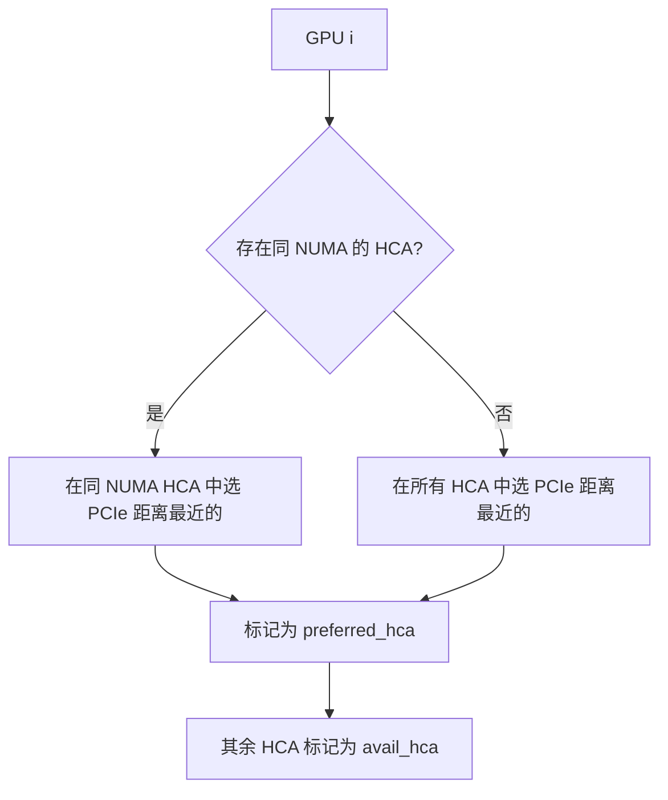

### 3.1.4 设备选择与回退机制

```cpp
// mooncake-transfer-engine/src/topology.cpp:572-598
int Topology::selectDevice(const std::string storage_type, int retry_count) {
    auto &entry = resolved_matrix_[storage_type];
    if (retry_count == 0) {
        // 首次尝试：随机选择 preferred 或 avail
        if (!entry.preferred_hca.empty())
            return entry.preferred_hca[rand_value % entry.preferred_hca.size()];
        else
            return entry.avail_hca[rand_value % entry.avail_hca.size()];
    } else {
        // 重试：按顺序遍历所有 HCA
        size_t index = (retry_count - 1) % 
                       (entry.preferred_hca.size() + entry.avail_hca.size());
        if (index < entry.preferred_hca.size())
            return entry.preferred_hca[index];
        else
            return entry.avail_hca[index - entry.preferred_hca.size()];
    }
}
```

### 3.1.5 GPU Direct RDMA 零拷贝注册

```cpp
// mooncake-transfer-engine/src/transport/rdma_transport/rdma_context.cpp:212-269
int RdmaContext::registerMemoryRegionInternal(void *addr, size_t length,
                                              int access, MemoryRegionMeta &mrMeta) {
#if defined(USE_CUDA) && !defined(WITH_NVIDIA_PEERMEM)
    // 判断内存类型：CPU 还是 GPU
    CUmemorytype memType;
    cuPointerGetAttribute(&memType, CU_POINTER_ATTRIBUTE_MEMORY_TYPE, 
                          (CUdeviceptr)addr);

    if (memType == CU_MEMORYTYPE_HOST) {
        // CPU 内存：传统 ibv_reg_mr
        mrMeta.mr = ibv_reg_mr(pd_, addr, length, access);
    } else if (memType == CU_MEMORYTYPE_DEVICE) {
        // GPU 显存：通过 DMA-BUF 实现 GPUDirect RDMA
        int dmabuf_fd;
        cuMemGetHandleForAddressRange(&dmabuf_fd, (CUdeviceptr)addr, allocSize,
                                      CU_MEM_RANGE_HANDLE_TYPE_DMA_BUF_FD, 0);
        mrMeta.mr = ibv_reg_dmabuf_mr(pd_, 0, length, 
                                      (uintptr_t)addr, dmabuf_fd, access);
    }
#else
    // 有 nvidia-peermem 时直接注册
    mrMeta.mr = ibv_reg_mr(pd_, addr, length, access);
#endif
}
```

**内存注册路径对比**：

| 内存类型                 | 注册方式                  | 是否需要额外驱动       | 代码路径                   |
| -------------------- | --------------------- | -------------- | ---------------------- |
| CPU Pinned Memory    | `ibv_reg_mr()`        | 否              | `rdma_context.cpp:232` |
| GPU VRAM (有 peermem) | `ibv_reg_mr()`        | nvidia-peermem | `rdma_context.cpp:262` |
| GPU VRAM (无 peermem) | `ibv_reg_dmabuf_mr()` | CUDA DMA-BUF   | `rdma_context.cpp:257` |

## 3.2 SIEVE 端点池化技术

### 3.2.1 数据结构设计

```cpp
// mooncake-transfer-engine/include/transport/rdma_transport/endpoint_store.h:86-119
class SIEVEEndpointStore : public EndpointStore {
   private:
    RWSpinlock endpoint_map_lock_;
    // endpoint_map_: peer_nic_path -> (RdmaEndPoint, visited_flag)
    std::unordered_map<
        std::string, 
        std::pair<std::shared_ptr<RdmaEndPoint>, std::atomic_bool>>
        endpoint_map_;

    std::list<std::string> fifo_list_;           // FIFO 链表
    std::unordered_map<std::string, 
                       std::list<std::string>::iterator> fifo_map_;

    std::optional<std::list<std::string>::iterator> hand_;  // SIEVE 手指针

    std::unordered_set<std::shared_ptr<RdmaEndPoint>> waiting_list_;  // 待回收
    std::atomic<int> waiting_list_len_;
    size_t max_size_;
};
```

### 3.2.2 SIEVE 算法核心逻辑

```cpp
// mooncake-transfer-engine/src/transport/rdma_transport/endpoint_store.cpp:191-217
void SIEVEEndpointStore::evictEndpoint() {
    auto o = hand_.has_value() ? hand_.value() : --fifo_list_.end();
    std::string victim;
    while (true) {
        victim = *o;
        if (endpoint_map_[victim].second.load(std::memory_order_relaxed)) {
            // visited=true: 标记为 false，跳过（快速降级）
            endpoint_map_[victim].second.store(false, std::memory_order_relaxed);
            o = (o == fifo_list_.begin() ? --fifo_list_.end() : std::prev(o));
        } else {
            break;  // visited=false: 驱逐此 endpoint
        }
    }
    // 更新 hand 指针
    o == fifo_list_.begin() ? hand_ = std::nullopt : hand_ = std::prev(o);
    fifo_list_.erase(o);
    fifo_map_.erase(victim);
    // 移入等待列表，等待 outstanding slices 完成
    waiting_list_len_++;
    waiting_list_.insert(endpoint_map_[victim].first);
    endpoint_map_.erase(victim);
}
```

**SIEVE 算法执行流程**：

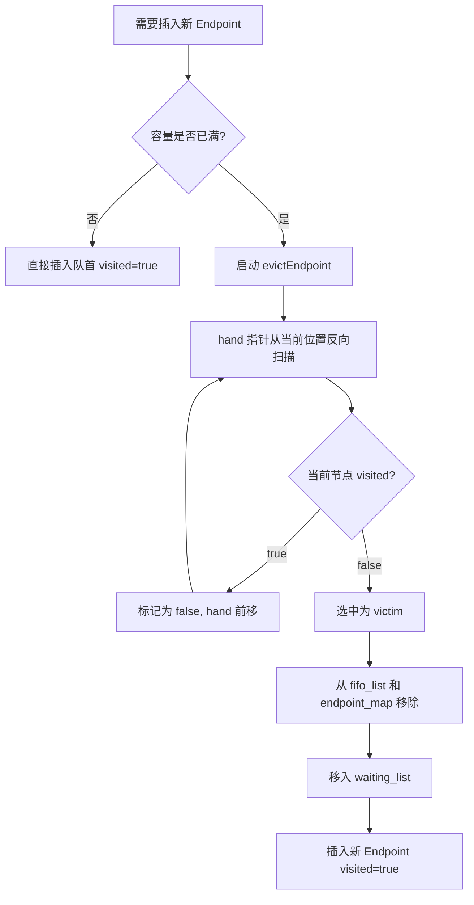

### 3.2.3 完整操作对照表

| 操作                    | 代码位置                         | 行为                                                 |
| --------------------- | ---------------------------- | -------------------------------------------------- |
| `getEndpoint(key)`    | `endpoint_store.cpp:127-140` | 查找 endpoint，若存在则将 `visited` 设为 `true`              |
| `insertEndpoint(key)` | `endpoint_store.cpp:142-168` | 新建 endpoint，`visited=true`，插入队首；若满则触发驱逐            |
| `evictEndpoint()`     | `endpoint_store.cpp:191-217` | SIEVE 算法核心：从 hand 反向扫描，驱逐第一个 visited=false 的节点     |
| `reclaimEndpoint()`   | `endpoint_store.cpp:219-227` | 清理 waiting_list 中 outstanding slices 已完成的 endpoint |
| `deleteEndpoint(key)` | `endpoint_store.cpp:170-189` | 标记 endpoint 为 inactive，移入 waiting_list             |

```cpp
// getEndpoint: 访问时标记 visited=true
std::shared_ptr<RdmaEndPoint> SIEVEEndpointStore::getEndpoint(
    const std::string &peer_nic_path) {
    auto iter = endpoint_map_.find(peer_nic_path);
    if (iter != endpoint_map_.end()) {
        iter->second.second.store(true, std::memory_order_relaxed);
        return iter->second.first;
    }
    return nullptr;
}

// reclaimEndpoint: 安全回收无 outstanding 的 endpoint
void SIEVEEndpointStore::reclaimEndpoint() {
    if (waiting_list_len_.load() == 0) return;
    std::vector<std::shared_ptr<RdmaEndPoint>> to_delete;
    for (auto &endpoint : waiting_list_)
        if (!endpoint->hasOutstandingSlice()) to_delete.push_back(endpoint);
    for (auto &endpoint : to_delete) waiting_list_.erase(endpoint);
    waiting_list_len_ -= to_delete.size();
}
```

### 3.2.4 SIEVE vs FIFO 对比

| 特性    | FIFO                        | SIEVE                        |
| ----- | --------------------------- | ---------------------------- |
| 驱逐策略  | 驱逐最先进入的                     | 驱逐未被访问过的                     |
| 新节点保护 | 无                           | visited=true 保护一轮            |
| 手指针   | 无                           | hand_ 记录上次位置                 |
| 适用场景  | 连接模式稳定                      | 连接模式动态变化                     |
| 代码位置  | `endpoint_store.cpp:30-116` | `endpoint_store.cpp:127-258` |

## 3.3 PD 分离 Layer-wise 异步流水线

### 3.3.1 HiCache 设计文档中的异步流水线

根据 `docs/source/design/hicache-design.md`，Layer-wise 流水线采用双线程模型：

```
Prefetch Pipeline Architecture:
┌─────────────────────────────────────────────────────────┐
│                    Prefetch Thread                       │
│  ┌─────────────┐    ┌──────────────┐    ┌─────────────┐ │
│  │ 查询缓存状态 │ -> │ 计算预取范围  │ -> │ 提交预取任务 │ │
│  └─────────────┘    └──────────────┘    └─────────────┘ │
└─────────────────────────────────────────────────────────┘
                          │
                          ▼
┌─────────────────────────────────────────────────────────┐
│                    IO Thread                             │
│  ┌─────────────┐    ┌──────────────┐    ┌─────────────┐ │
│  │ 执行 RDMA 读取│ -> │ 数据写入目标  │ -> │ 完成回调通知 │ │
│  └─────────────┘    └──────────────┘    └─────────────┘ │
└─────────────────────────────────────────────────────────┘
```

### 3.3.2 预取触发与策略

```
Prefetch Trigger Condition:
  L3 命中长度 >= prefetch_threshold (默认 256 tokens)

Prefetch Strategies:
  1. wait_complete: 等待预取完成后再继续
  2. timeout:       超时后继续执行
  3. best_effort:   尽力而为，不阻塞主流程

Dynamic Timeout Calculation:
  timeout = prefetch_timeout_base + 
            prefetch_timeout_per_ki_token * num_token_to_fetch / 1024
```

### 3.3.3 Layer-wise 计算与传输重叠

```mermaid
gantt
    title Layer-wise 异步流水线时序图
    dateFormat X
    axisFormat %L

    section Layer N
    Prefill 计算      :0, 100
    KVCache 传输       :80, 180

    section Layer N+1
    数据加载 (并行)    :60, 160
    Prefill 计算       :160, 260
    KVCache 传输       :240, 340

    section Layer N+2
    数据加载 (并行)    :220, 320
    Prefill 计算       :320, 420
```

**关键设计原则**：
1）Layer N Prefill 完成后立即触发 KVCache 传输
2）Layer N+1 的数据加载与 Layer N 的计算并行，不阻塞主流程
3）Prefetch Thread 负责查询状态 + 提交任务，IO Thread 负责执行传输

# 四、Mooncake Store：内存池与存储管理

对应论文：MOONCAKE Store Design (Section 4)
逻辑位置：系统的底座，解释数据存在哪里、如何管理

## 4.1 内存池架构与全局命名空间

### 4.1.1 Master-Client 架构

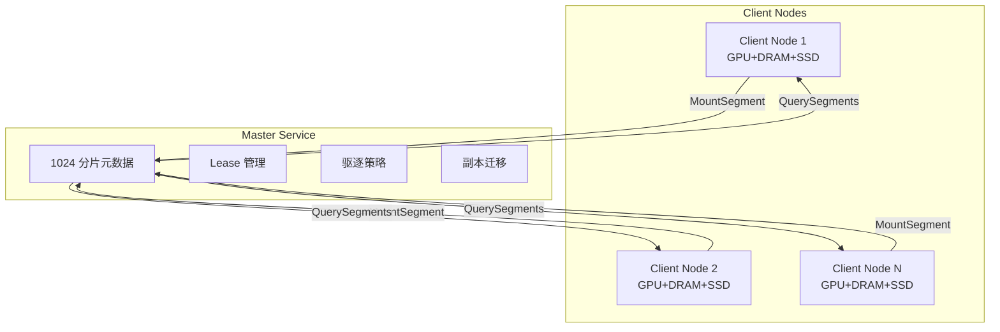

### 4.1.2 Master 分片架构

```cpp
// mooncake-store/include/master_service.h:841-854
static constexpr size_t kNumShards = 1024;  // 元数据分片数量

struct MetadataShard {
    mutable SharedMutex mutex;
    std::unordered_map<std::string, ObjectMetadata> metadata GUARDED_BY(mutex);
    std::unordered_set<std::string> processing_keys GUARDED_BY(mutex);
    std::unordered_map<std::string, const ReplicationTask> replication_tasks GUARDED_BY(mutex);
    std::unordered_map<std::string, const OffloadingTask> offloading_tasks GUARDED_BY(mutex);
};
std::array<MetadataShard, kNumShards> metadata_shards_;
```

**分片路由**：

```cpp
// mooncake-store/include/master_service.h:889-891
size_t getShardIndex(const std::string& key) const {
    return std::hash<std::string>{}(key) % kNumShards;
}
```

### 4.1.3 ObjectMetadata 结构

```cpp
// mooncake-store/include/master_service.h:576-823
struct ObjectMetadata {
    UUID client_id;                                    // 所属客户端
    std::chrono::system_clock::time_point put_start_time;  // 写入开始时间
    const size_t size;                                 // 对象大小

    mutable SpinLock lock;
    mutable std::chrono::system_clock::time_point lease_timeout GUARDED_BY(lock);  // hard lease
    mutable std::optional<std::chrono::system_clock::time_point> soft_pin_timeout GUARDED_BY(lock);  // soft pin
    const bool hard_pinned{false};                     // 硬锁定，不可驱逐

    std::vector<Replica> replicas_;                    // 副本列表
};
```

## 4.2 RDMA 注册与介质支持

### 4.2.1 Segment 注册流程

```cpp
// mooncake-store/src/segment.cpp:25-131
ErrorCode ScopedSegmentAccess::MountSegment(const Segment& segment,
                                            const UUID& client_id) {
    const uintptr_t buffer = segment.base;
    const size_t size = segment.size;

    // 1. 参数校验
    if (buffer == 0 || size == 0) {
        return ErrorCode::INVALID_PARAMS;
    }

    // 2. 检查是否已存在
    auto exist_segment_it = segment_manager_->mounted_segments_.find(segment.id);
    if (exist_segment_it != segment_manager_->mounted_segments_.end()) {
        return ErrorCode::SEGMENT_ALREADY_EXISTS;
    }

    // 3. 根据类型创建 Allocator
    std::shared_ptr<BufferAllocatorBase> allocator;
    switch (segment_manager_->memory_allocator_) {
        case BufferAllocatorType::CACHELIB:
            allocator = std::make_shared<CachelibBufferAllocator>(
                segment.name, buffer, size, segment.te_endpoint);
            break;
        case BufferAllocatorType::OFFSET:
            allocator = std::make_shared<OffsetBufferAllocator>(
                segment.name, buffer, size, segment.te_endpoint);
            break;
    }

    // 4. 注册到 AllocatorManager
    segment_manager_->allocator_manager_.addAllocator(segment.name, allocator);
    segment_manager_->client_segments_[client_id].push_back(segment.id);
    segment_manager_->mounted_segments_[segment.id] = {
        segment, SegmentStatus::OK, std::move(allocator)};
    return ErrorCode::OK;
}
```

**MountSegment 完整流程**：

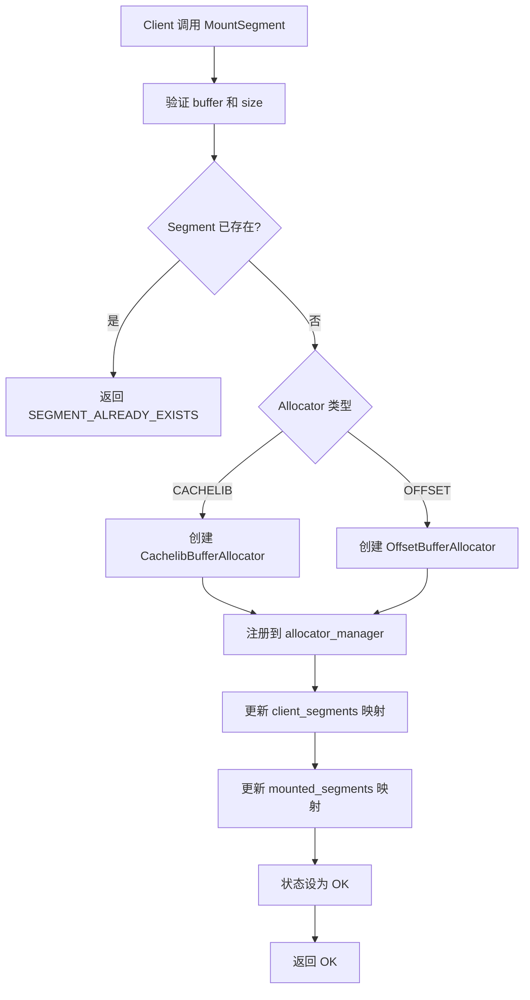

### 4.2.2 UnmountSegment 两阶段卸载

```cpp
// mooncake-store/src/segment.cpp:177-258
// 阶段 1: PrepareUnmount
ErrorCode ScopedSegmentAccess::PrepareUnmountSegment(
    const UUID& segment_id, size_t& metrics_dec_capacity) {
    auto it = segment_manager_->mounted_segments_.find(segment_id);
    // 1. 从 allocator_manager 移除
    segment_manager_->allocator_manager_.removeAllocator(segment.name, allocator);
    // 2. 状态设为 UNMOUNTING
    mounted_segment.status = SegmentStatus::UNMOUNTING;
    return ErrorCode::OK;
}

// 阶段 2: CommitUnmount
ErrorCode ScopedSegmentAccess::CommitUnmountSegment(
    const UUID& segment_id, const UUID& client_id,
    const size_t& metrics_dec_capacity) {
    // 从 client_segments 移除
    // 从 mounted_segments 移除
    // 更新容量指标
    MasterMetricManager::instance().dec_total_mem_capacity(
        segment_name, metrics_dec_capacity);
    return ErrorCode::OK;
}
```

**两阶段卸载流程**：

```mermaid
flowchart LR
    A[UnmountSegment 请求] --> B[PrepareUnmountSegment]
    B --> C[从 allocator_manager 移除]
    C --> D[状态设为 UNMOUNTING]
    D --> E[ClearInvalidHandles]
    E --> F[清理无效句柄]
    F --> G[CommitUnmountSegment]
    G --> H[从 client_segments 移除]
    H --> I[从 mounted_segments 移除]
    I --> J[更新容量指标]
```

### 4.2.3 RDMA 内存注册实现

```cpp
// mooncake-transfer-engine/src/transport/rdma_transport/rdma_context.cpp:212-269
int RdmaContext::registerMemoryRegionInternal(void *addr, size_t length,
                                              int access, MemoryRegionMeta &mrMeta) {
#if defined(USE_CUDA) && !defined(WITH_NVIDIA_PEERMEM)
    CUmemorytype memType;
    cuPointerGetAttribute(&memType, CU_POINTER_ATTRIBUTE_MEMORY_TYPE, 
                          (CUdeviceptr)addr);

    if (memType == CU_MEMORYTYPE_HOST) {
        // CPU 内存
        mrMeta.mr = ibv_reg_mr(pd_, addr, length, access);
    } else if (memType == CU_MEMORYTYPE_DEVICE) {
        // GPU 显存 - DMA-BUF 方式
        int dmabuf_fd;
        cuMemGetHandleForAddressRange(&dmabuf_fd, (CUdeviceptr)addr, allocSize,
                                      CU_MEM_RANGE_HANDLE_TYPE_DMA_BUF_FD, 0);
        mrMeta.mr = ibv_reg_dmabuf_mr(pd_, 0, length, 
                                      (uintptr_t)addr, dmabuf_fd, access);
    }
#else
    mrMeta.mr = ibv_reg_mr(pd_, addr, length, access);
#endif
}
```

## 4.3 分层存储与驱逐策略

### 4.3.1 透明分级链路

```
VRAM/HBM → DRAM → SSD/NVMe → 共享存储
   │          │        │          │
   │          │        │          └─ 3FS/NFS 共享存储
   │          │        └─ 磁盘后端 (StorageBackend)
   │          └─ 内存池 (BufferAllocator)
   └─ GPU 显存 (GPUDirect RDMA)
```

### 4.3.2 内存驱逐机制（BatchEvict）

```cpp
// mooncake-store/src/master_service.cpp:3440-3639
void MasterService::BatchEvict(double evict_ratio_target,
                               double evict_ratio_lowerbound) {
    // 驱逐条件：memory replica && completed && refcnt == 0
    auto can_evict_replicas = [](const ObjectMetadata& metadata) {
        return metadata.HasReplica([](const Replica& replica) {
            return replica.is_memory_replica() && replica.is_completed() &&
                   replica.get_refcnt() == 0;
        });
    };

    // 随机选择起始分片，避免分片间驱逐不均衡
    size_t start_idx = rand() % kNumShards;

    // 第一阶段：驱逐无 soft pin 且 lease 过期的对象
    for (size_t i = 0; i < kNumShards; i++) {
        MetadataShardAccessorRW shard(this, (start_idx + i) % kNumShards);
        for (auto it = shard->metadata.begin(); it != shard->metadata.end(); it++) {
            // Hard-pinned 对象永不驱逐
            if (it->second.IsHardPinned()) continue;
            if (!it->second.IsLeaseExpired(now) || !can_evict_replicas(it->second)) continue;

            if (!it->second.IsSoftPinned(now)) {
                candidates.push_back(it->second.lease_timeout);  // 第一阶段候选
            } else if (allow_evict_soft_pinned_objects_) {
                soft_pin_objects.push_back(it->second.lease_timeout);  // 第二阶段候选
            }
        }
        // 使用 nth_element 按 lease 超时时间选择驱逐目标（近似 LRU）
        std::nth_element(candidates.begin(), candidates.begin() + (evict_num - 1), 
                        candidates.end());
    }

    // 第二阶段：若驱逐数量不足，驱逐 soft pin 对象（如果允许）
}
```

**BatchEvict 两阶段驱逐流程**：

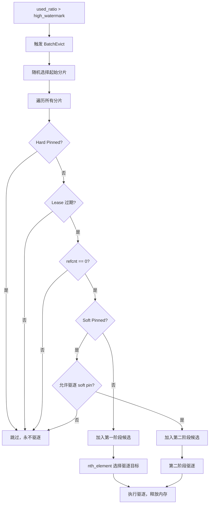

### 4.3.3 驱逐策略配置

```cpp
// mooncake-store/include/master_config.h
double eviction_ratio = 0.1;                    // 驱逐比例 10%
double eviction_high_watermark_ratio = 1.0;      // 高水位 100%
bool allow_evict_soft_pinned_objects_ = false;   // 是否允许驱逐 soft pin
```

**触发条件**（`master_service.cpp:2196-2207`）：

```cpp
if (used_ratio > eviction_high_watermark_ratio_ || 
    (need_eviction_ && eviction_ratio_ > 0.0)) {
    BatchEvict(evict_ratio_target, 
               used_ratio - eviction_high_watermark_ratio_);
}
```

### 4.3.4 磁盘后端驱逐策略

```cpp
// mooncake-store/include/storage_backend.h:174-196
enum class BucketEvictionPolicy {
    NONE,   // 无驱逐（默认）
    FIFO,   // 按创建顺序驱逐最旧的 bucket
    LRU,    // 按最近访问时间驱逐
};

struct BucketBackendConfig {
    int64_t bucket_size_limit = 256 * kMB;   // 单个 bucket 最大 256MB
    int64_t bucket_keys_limit = 500;          // 单个 bucket 最多 500 个 key
    BucketEvictionPolicy eviction_policy = BucketEvictionPolicy::NONE;
    int64_t max_total_size = 0;               // 0 = 无限制
};
```

**FIFO 磁盘驱逐实现**：

```cpp
// mooncake-store/src/storage_backend.cpp:832-867
FileRecord StorageBackend::EvictFile() {
    if (!IsEvictionEnabled()) {
        return {};  // 3FS 模式下驱逐禁用
    }
    FileRecord record_to_evict = SelectFileToEvictByFIFO();
    if (fs::remove(record_to_evict.path, ec)) {
        RemoveFileFromWriteQueue(record_to_evict.path);
        ReleaseSpace(file_size);
        return record_to_evict;
    }
    return {};
}

FileRecord StorageBackend::SelectFileToEvictByFIFO() {
    std::unique_lock<std::shared_mutex> lock(file_queue_mutex_);
    if (file_write_queue_.empty()) return {};
    return file_write_queue_.front();  // FIFO: 最早写入的最先驱逐
}
```

### 4.3.5 热点保护（Pin 机制）

```cpp
// mooncake-store/include/master_service.h:782-795
bool IsSoftPinned() const {
    SpinLocker locker(&lock);
    return soft_pin_timeout && 
           std::chrono::system_clock::now() < *soft_pin_timeout;
}

bool IsHardPinned() const { return hard_pinned; }

// mooncake-store/include/master_service.h:757-768
void GrantLease(const uint64_t ttl, const uint64_t soft_ttl) const {
    SpinLocker locker(&lock);
    std::chrono::system_clock::time_point now = std::chrono::system_clock::now();
    lease_timeout = std::max(lease_timeout, now + std::chrono::milliseconds(ttl));
    if (soft_pin_timeout) {
        soft_pin_timeout = std::max(*soft_pin_timeout,
                     now + std::chrono::milliseconds(soft_ttl));
    }
}
```

**Pin 机制对比**：

| 类型       | 设置方式                        | 驱逐行为         | TTL                    | 代码位置                   |
| -------- | --------------------------- | ------------ | ---------------------- | ---------------------- |
| Hard Pin | 创建时 `hard_pinned=true`      | 永不驱逐         | 无                      | `master_service.h:626` |
| Soft Pin | `GrantLease(ttl, soft_ttl)` | TTL 过期后可驱逐   | 可配置                    | `master_service.h:624` |
| 无 Pin    | 默认                          | Lease 过期后可驱逐 | `default_kv_lease_ttl` | `master_service.h:621` |

### 4.3.6 写回策略（Write-back Policies）

```cpp
// mooncake-store/include/storage_backend.h:250-256
virtual tl::expected<int64_t, ErrorCode> BatchOffload(
    const std::unordered_map<std::string, std::vector<Slice>>& batch_object,
    std::function<ErrorCode(...)> complete_handler,
    std::function<void(const std::vector<std::string>& evicted_keys)> eviction_handler
) = 0;
```

**Offload 完整流程**：

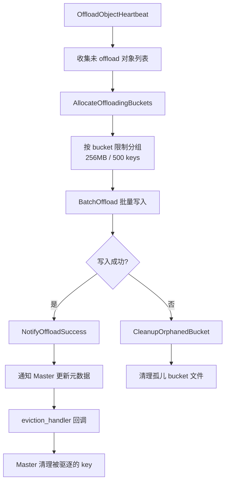

## 4.4 内存生命周期管理

### 4.4.1 双分配器架构

| 分配器                     | 特点                        | 适用场景            | 代码位置                    |
| ----------------------- | ------------------------- | --------------- | ----------------------- |
| CachelibBufferAllocator | Facebook CacheLib slab 分配 | 不规则大小 KVCache   | `allocator.cpp:74-163`  |
| OffsetBufferAllocator   | Offset 连续内存分配             | 固定/已知大小 KVCache | `allocator.cpp:166-286` |

### 4.4.2 OffsetAllocator 的 256 Bin 机制

```cpp
// mooncake-store/include/offset_allocator/offset_allocator.hpp:23-27
static constexpr uint32 NUM_TOP_BINS = 32;
static constexpr uint32 BINS_PER_LEAF = 8;
static constexpr uint32 TOP_BINS_INDEX_SHIFT = 3;
static constexpr uint32 LEAF_BINS_INDEX_MASK = 0x7;
static constexpr uint32 NUM_LEAF_BINS = NUM_TOP_BINS * BINS_PER_LEAF;  // 256 bins
```

**Bin 查找算法**：

```cpp
// mooncake-store/src/offset_allocator.cpp:187-285
OffsetAllocation __Allocator::allocate(uint32 size) {
    // 将大小转换为 bin 索引（浮点编码）
    uint32 minBinIndex = SmallFloat::uintToFloatRoundUp(size);
    uint32 minTopBinIndex = minBinIndex >> TOP_BINS_INDEX_SHIFT;
    uint32 minLeafBinIndex = minBinIndex & LEAF_BINS_INDEX_MASK;

    // 查找合适的 bin
    uint32 topBinIndex = minTopBinIndex;
    uint32 leafBinIndex = OffsetAllocation::NO_SPACE;
    if (m_usedBinsTop & (1 << topBinIndex)) {
        leafBinIndex = findLowestSetBitAfter(m_usedBins[topBinIndex], minLeafBinIndex);
    }
    // 若当前 top bin 无空间，搜索更大的 bin
    if (leafBinIndex == OffsetAllocation::NO_SPACE) {
        topBinIndex = findLowestSetBitAfter(m_usedBinsTop, minTopBinIndex + 1);
        leafBinIndex = tzcnt_nonzero(m_usedBins[topBinIndex]);
    }
    // ...
}
```

**Bin 组织结构**：

```
Top Bins (32)
├── Top Bin 0
│   ├── Leaf Bin 0 (最小)
│   ├── Leaf Bin 1
│   ├── ...
│   └── Leaf Bin 7
├── Top Bin 1
│   ├── Leaf Bin 0
│   ├── ...
│   └── Leaf Bin 7
├── ...
└── Top Bin 31
    ├── Leaf Bin 0
    ├── ...
    └── Leaf Bin 31 (最大, 3.75GB)

总共 32 × 8 = 256 个 Leaf Bin
Bin 大小按浮点格式 (exponent + mantissa) 分布
```

### 4.4.3 AllocatedBuffer RAII 管理

```cpp
// mooncake-store/include/allocator.h:25-89
class AllocatedBuffer {
    std::weak_ptr<BufferAllocatorBase> allocator_;
    void* buffer_ptr_{nullptr};
    std::size_t size_{0};
    std::optional<offset_allocator::OffsetAllocationHandle> offset_handle_;

    // 析构时自动释放
    ~AllocatedBuffer();
};

// mooncake-store/src/allocator.cpp:20-29
AllocatedBuffer::~AllocatedBuffer() {
    auto alloc = allocator_.lock();
    if (alloc) {
        alloc->deallocate(this);
        VLOG(1) << "buf_handle_deallocated size=" << size_;
    }
}
```

**OffsetAllocationHandle RAII**：

```cpp
// mooncake-store/src/offset_allocator.cpp:525-530
OffsetAllocationHandle::~OffsetAllocationHandle() {
    auto allocator = m_allocator.lock();
    if (allocator) {
        allocator->freeAllocation(m_allocation, requested_size);
    }
}
```

### 4.4.4 Segment 生命周期状态机

```cpp
// mooncake-store/include/segment.h:19-25
enum class SegmentStatus {
    UNDEFINED = 0,  // 未初始化
    OK,             // 正常，可分配
    DRAINING,       // 撤离中，只读不写
    DRAINED,        // 已撤离，等待卸载
    UNMOUNTING,     // 卸载中
};
```

**Segment 状态流转**：

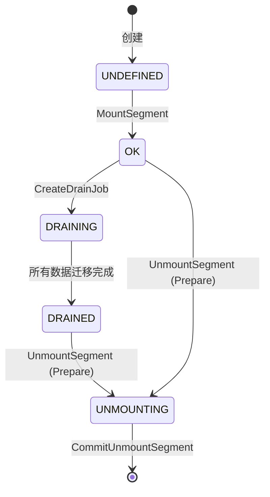

### 4.4.5 Client 端数据路径

**Get 操作路径**：

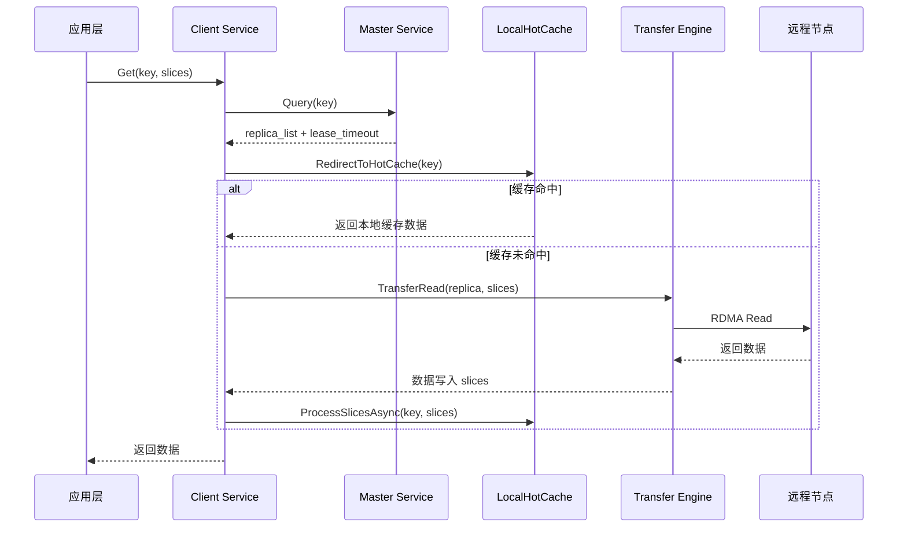

**Put 操作路径**：

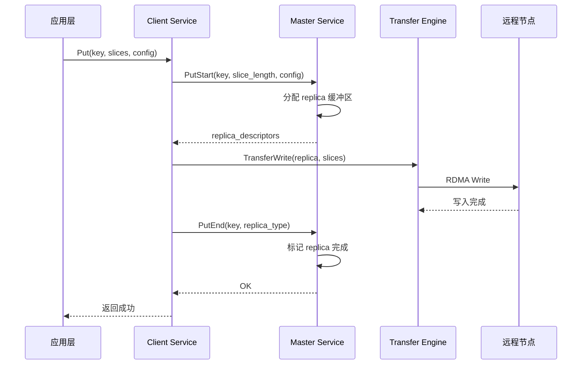

### 4.4.6 本地热缓存（LocalHotCache）

```cpp
// mooncake-store/include/local_hot_cache.h:37-158
class LocalHotCache {
    std::list<HotMemBlock*> lru_queue_ GUARDED_BY(lru_mutex_);
    std::unordered_map<std::string, std::list<HotMemBlock*>::iterator> key_to_lru_it_;

    // 延迟 LRU touch 优化
    void drainDeferredTouches();  // 批量将 accessed 块移到队首
};
```

**频率准入机制**：

```cpp
// mooncake-store/include/client_service.h:499-518
bool ShouldAdmitToHotCache(const std::string& key, bool cache_used) {
    if (!(hot_cache_ && !cache_used)) return false;
    if (admission_sketch_ == nullptr) return true;
    return admission_sketch_->increment(key) >= admission_threshold_;
}
```

1）`CountMinSketch` 实现频率过滤
2）只有访问次数 >= `admission_threshold_`（默认 2）的 key 才进入热缓存
3）异步 Put：`LocalHotCacheHandler` 通过线程池异步执行，避免阻塞主路径
