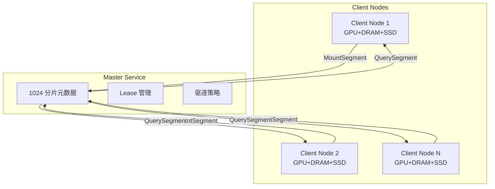
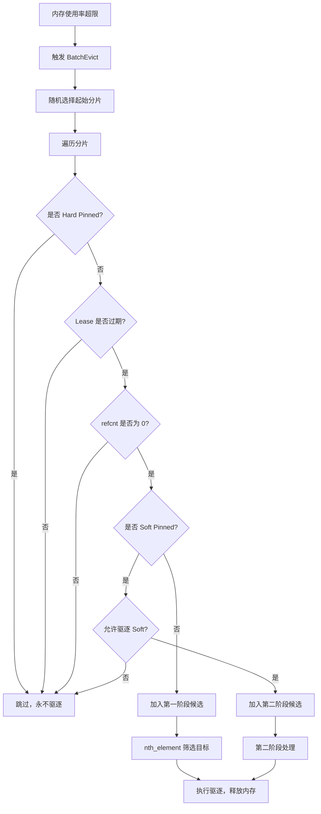

# 一、整体架构

Mooncake 采用了一种以 KVCache 为中心的分布式架构，旨在解决大模型推理中显存瓶颈和数据传输延迟的问题。

## 1.1 系统架构与组件交互

如架构图所示，Mooncake 的整体系统主要由四个核心部分组成：全局调度器（Conductor）、Prefill 资源池、Decoding 资源池以及分布式存储与传输引擎（Mooncake Store & Transfer Engine）。

### 1.1.1 Prefill/Decode 资源池

PD分离设计允许针对两个阶段不同的计算和内存特征进行独立的资源分配和调度优化。

1）Prefill Pool：处理高并发的首词生成（Prefill）阶段。其优化目标是最大化 KVCache 的重用率（max Cache Reuse），同时满足首字延迟（TTFT）的 SLO 要求。每个 Prefill Instance 内部包含 GPU/VRAM 和 CPU/DRAM/SSD，利用 Local Chunked Prefill Scheduler 管理显存内的 Paged KVCache。

2）Decoding Pool：解码阶段。其优化目标是最大化吞吐量（max Throughput），满足 token 生成时间（TBT）的 SLO。Decoding Instance 同样具备多级存储结构，通过 Local Scheduler 调度显存资源。

### 1.1.2 全局 Conductor 调度器

Conductor根据全局视角下发调度指令，不直接参与数据搬运。它包含三个关键组件：

1）Cache-aware Prefill Scheduler：负责为每个请求，选择一个能**最大化复用已缓存KVCache**且**负载最低**的Prefill节点。
2）KVCache Balance Scheduler：通过主动迁移热点KVCache来平衡KVCache在集群中的分布。
3）Load-balance Decoding Scheduler：根据各Decode节点的实时负载情况，选择一个负载最低的节点来处理该请求的解码工作。

### 1.1.3 多级 KV Store 与 Transfer Engine

1）Mooncake Store：是一个跨越所有 Instance 的分布式 KVCache 池。它利用 CPU 的 DRAM 和 SSD 构建了缓存池。
2）KVCache Transfer Engine：位于架构中心，通过 RDMA 连接各个节点的 Distributed KVCache Pool。它负责在实例之间高效地传输 KVCache 数据。

# 二、请求调度策略

调度器（Conductor）的核心目标是：**在严格满足延迟 SLO 的前提下，最大化 KVCache 复用率与集群整体吞吐**。请求调度分为四个阶段：

- 阶段 1：前缀匹配

将请求 Prompt 按固定 Block Size 切分并 Hash 生成 `block_keys`。再扫描全局元数据，找出持有最长公共前缀的实例节点 `best_instance`及其匹配长度 `best_len`。

- 阶段 2：prefill实例选择

遍历所有 Prefill 节点：

- 若 `best_len / instance.prefix_len > threshold`：说明当前节点缓存远少于最优节点，**远程拉取+计算** 比 **全量本地计算** 更快。此时预估传输耗时 `T_transfer`，并按 `best_len`计算剩余 Prefill 计算量（使用通过离线数据拟合的多项式回归模型来估计相应的执行时间）。
- 若比值未超阈值：说明当前节点缓存已足够，**就地计算** 可避免网络开销。此时 `T_transfer = 0`，按本地 `prefix_len`计算剩余 Prefill 计算量。

预估`TTFT = T_transfer(网络) + T_queue(排队) + T_prefill(计算)`。选择预估 TTFT 最小的节点p，并相应地更新该实例的缓存和队列时间。

- 阶段 3：请求拒绝

选定 `p` 后，同步选择负载最轻的 Decode 节点 `d`，并预估token生成间隔 `TBT`。若预估 `TTFT`或 `TBT`超出人工设定的 SLO 阈值，**直接拒绝请求**。避免在系统超载时盲目接纳请求导致雪崩，保障已接受请求的体验。

- 阶段 4：缓存调度

若最终选定的实例并非 `best_instance`，且缓存差距超阈值，Conductor会将缓存的位置和请求转发到目标实例，目标实例主动从缓存持有者处检索KVCache，并拉取缺失的 KVCache。

# 三、Transfer Engine

## 3.1 拓扑感知

在大规模 GPU 集群中，RDMA 传输性能高度依赖于数据路径是否经过 PCIe Switch 跨桥、NUMA 跨节点访问。一次跨 NUMA 的 RDMA 传输延迟远高于同 NUMA 内的传输延迟。因此，Transfer Engine 必须在初始化阶段构建完整的硬件拓扑地图，以便后续传输时选择最优的 RDMA 网卡。

拓扑发现流程：每个服务器扫描底层硬件拓扑（NUMA 节点、PCIe 总线），构建计算设备与 RDMA 网卡的亲和性矩阵。

```cpp
int Topology::discover(const std::vector<std::string> &filter) {
    matrix_.clear();
    // ★ 1. 获取所有RDMA NIC设备
    auto all_hca = listInfiniBandDevices(filter);
    // ★ 2. 生成CPU拓扑（基于NUMA亲和性）
    for (auto &ent : discoverCpuTopology(all_hca)) {
        matrix_[ent.name] = ent;  // "cpu:0", "cpu:1" ...
    }
    // ★ 3. 生成CUDA拓扑（基于PCIe距离）
#if defined(USE_CUDA) || defined(USE_MUSA) || ...
    for (auto &ent : discoverCudaTopology(all_hca)) {
        matrix_[ent.name] = ent;  // "cuda:0", "cuda:1" ...
    }
#endif
    return resolve();
}
```

每个服务器生成一个拓扑矩阵并在集群中广播它。该矩阵将网络接口卡（NIC）分为“首选”和“次要”列表。在正常情况下，选择首选列表中的NIC进行传输，从而仅通过本地NUMA或GPU Direct RDMA通过本地PCIe交换机促进RDMA操作。在发生故障时，可以使用来自两个列表的NIC。

```cpp
int Topology::selectDevice(const std::string storage_type, int retry_count) {
    // storage_type = "cpu:0", "cuda:1" 等存储位置标识
    if (resolved_matrix_.count(storage_type) == 0) 
        return ERR_DEVICE_NOT_FOUND;

    auto &entry = resolved_matrix_[storage_type]; //从拓扑表中获取该存储位置的网卡信息

    if (retry_count == 0) {
        // ★ 首次选择：从preferred随机选一个，随机负载均衡，避免所有请求都打到同一个网卡，造成负载不均衡
        int rand_value = SimpleRandom::Get().next();
        if (!entry.preferred_hca.empty()) // 正常情况，返回rand_value这个随机数映射的首选网卡
            return entry.preferred_hca[rand_value % entry.preferred_hca.size()];
        else // 极端情况，首选网卡是空的，返回rand_value这个随机数映射的候选网卡
            return entry.avail_hca[rand_value % entry.avail_hca.size()];
    } else {
        // ★ 重试（上次选的设备失败了，需要换个设备试一下）：遍历preferred → avail
        //  retry_count超过总数时，用 % 循环回前面的设备
        size_t index = (retry_count - 1) %
                       (entry.preferred_hca.size() + entry.avail_hca.size()); 
        if (index < entry.preferred_hca.size())
            return entry.preferred_hca[index];  // 索引在 preferred 范围内，直接返回 preferred[index]
        else {
            index -= entry.preferred_hca.size(); // 索引超出 preferred 范围，需要从 avail 中选取
            return entry.avail_hca[index];      // avail
        }
    }
}
```

## 3.2 SIEVE 端点池化技术

针对大规模并发连接导致的 QP 资源耗尽问题，Transfer Engine 引入 SIEVE 缓存淘汰算法管理 RDMA Endpoints。相比传统 LRU/FIFO，SIEVE 利用原子访问标志位和单向扫描机制，在极低锁竞争下实现高命中率，并通过延迟回收队列（waiting_list）确保正在进行的 RDMA 传输安全完成，有效平衡了资源利用率与连接稳定性。

## 3.3 PD 分离 Layer-wise 异步流水线

Layer-wise异步流水线 是 Mooncake 在 KVCache 生命周期管理中采用的细粒度流水线策略。

- 传统做法：Prefill 阶段需等待模型所有 N 层全部计算完成后，再统一打包传输 KVCache。
- 痛点：
  1. 显存峰值极高（需同时驻留全部层的 KVCache）
  2. 计算与传输串行执行，GPU 网卡闲置，硬件利用率低
  3. Decode 节点必须等全部 Prefill 结束才能拿到 KVCache，拉长首 Token 延迟（TTFT）
* Layer-wise 工作原理

Mooncake 打破”整体计算→整体传输”的串行模式，改为以模型层（Layer）为调度粒度的异步流水线：

1. 计算第 i 层 → GPU 完成该层 Prefill 计算，生成对应的 KVCache
2. 立即触发传输/卸载 → 该层 KVCache 立刻启动异步流程：通过 KVCache Transfer Engine 发给 Decode Instance，或Dump 至 CPU/DRAM 进行 Offload
3. GPU 不等待 → 传输/卸载在后台异步进行的同时，GPU 立即开始计算第 i+1 层
4. 循环推进，形成 计算下一层 ↔ 传输上一层 的完全重叠流水线

# 四、Mooncake Store：内存池与存储管理

## 4.1 内存池架构

Master Service 采用 1024 分片架构解决海量元数据的并发访问瓶颈，将全局锁粒度细化至分片级别。配合 `ObjectMetadata` 的多级租约（Lease/Pin）机制，在保障数据一致性的前提下，实现高吞吐的 KVCache 对象查询、状态追踪与生命周期控制，构建起跨越所有节点的统一分布式内存池。



## 4.2 Master 分片架构

`MasterService` 采用 1024 个分片（`kNumShards = 1024`），每个分片包含：

```cpp
// mooncake-store/include/master_service.h:841-854
static constexpr size_t kNumShards = 1024;  // 元数据分片数量

std::array<MetadataShard, kNumShards> metadata_shards_;

struct MetadataShard {
    mutable SharedMutex mutex;
    std::unordered_map<std::string, ObjectMetadata> metadata GUARDED_BY(mutex);
    std::unordered_set<std::string> processing_keys GUARDED_BY(mutex);
    std::unordered_map<std::string, const ReplicationTask> replication_tasks GUARDED_BY(mutex);
    std::unordered_map<std::string, const OffloadingTask> offloading_tasks GUARDED_BY(mutex);
};
```

1. **`metadata`**：核心元数据表，存储 `key → ObjectMetadata` 的映射。包括副本列表、租约超时时间、Pin 状态等。
2. **`processing_keys`**：正在处理中的 key 集合，用于防止并发重复写入。当 Client A 正在写入 key "foo" 时，Client B 的写入请求会被拒绝或排队。
3. **`replication_tasks`**：副本复制任务表，跟踪异步复制操作的进度（如从节点 A 复制到节点 B）。
4. **`offloading_tasks`**：磁盘卸载任务表，跟踪从内存卸载到 SSD 的异步任务。

**分片路由算法**：

`getShardIndex(key)` 通过 `std::hash<std::string>(key) % 1024` 计算 key 所属分片索引。

```cpp
// mooncake-store/include/master_service.h:889-891
size_t getShardIndex(const std::string& key) const {
    return std::hash<std::string>{}(key) % kNumShards;
}
```

该算法保证：

- **一致性**：同一个 key 始终路由到同一个分片，避免元数据分散。

- **均匀分布**：`std::hash` 的 avalanche effect 确保 key 均匀分布在 1024 个分片中，避免热点分片。

- **O(1) 查找**：无需遍历，直接计算分片索引。

## 4.3 热点保护（Pin 机制）

在 Mooncake Store 中，Lease（租约）和 Pin（锁定）是内存生命周期管理的核心机制，用于控制 KVCache 对象在内存紧张时是否被驱逐（Evict），确保数据在不同访问阶段的安全性。

```cpp
// master_service.h:621-626 - ObjectMetadata 中的三个关键字段
mutable std::chrono::system_clock::time_point lease_timeout
    GUARDED_BY(lock);  //Lease 超时时间
mutable std::optional<std::chrono::system_clock::time_point>
    soft_pin_timeout GUARDED_BY(lock);  // Soft Pin 超时时间
const bool hard_pinned{false};          // Hard Pin
```

### 4.3.1 Lease（租约）：短期保护

- 作用：防止对象在读取时被删除/驱逐
  - 当 Client 调用 GetReplicaList（查询对象位置）时，Master 会自动为该对象续期 Lease。
    
    ```cpp
        auto MasterService::GetReplicaList(const std::string& key) {
            // ... 查找元数据 ...
            
            // 核心动作：授予租约和软锁
            // default_kv_lease_ttl_: 租约时长（如 10s）
            // default_kv_soft_pin_ttl_: 软锁时长（如 5min）
            metadata.GrantLease(default_kv_lease_ttl_, default_kv_soft_pin_ttl_);
            
            return GetReplicaListResponse(...);
        }

        // mooncake-store/include/master_service.h:757-768
        void GrantLease(const uint64_t ttl, const uint64_t soft_ttl) const {
            SpinLocker locker(&lock); // 多个客户端可能同时访问同一个对象，且GrantLease 可能与驱逐线程并发执行
            std::chrono::system_clock::time_point now = std::chrono::system_clock::now();
            lease_timeout = std::max(lease_timeout, now + std::chrono::milliseconds(ttl));
            if (soft_pin_timeout) {
                soft_pin_timeout = std::max(*soft_pin_timeout,
                            now + std::chrono::milliseconds(soft_ttl));
            }
        }
    ```
  - 每个 ObjectMetadata 都有一个 lease_timeout 时间戳。
  - 每次续期会将 lease_timeout 更新为 当前时间 + TTL。
  - 在 BatchEvict（批量驱逐）时，如果 lease_timeout 还没过期，该对象绝对不会被驱逐。

### 4.3.2 Pin（锁定）：中长期保护

Pin 分为两种：Soft Pin（软锁定） 和 Hard Pin（硬锁定）。
#### Soft Pin（软锁定）：中期保护
- 作用：保护热点数据。刚刚被读取的对象在未来短时间内被再次读取的概率很高（时间局部性），Soft Pin 防止它们被立即驱逐，提高缓存命中率。

- 触发时机：
  - 与 Lease 同时触发。在 GrantLease 时，除了设置 lease_timeout，还会设置 soft_pin_timeout。
  - Soft Pin 的 TTL 通常比 Lease 长（例如 Lease 是 10s，Soft Pin 是 5min）。

- 实现机制：
  - ObjectMetadata 中有 soft_pin_timeout 字段。
  - 驱逐优先级低：在 BatchEvict 中，Master 会优先驱逐没有 Soft Pin 的对象。只有当内存极度紧张（第一阶段驱逐不够）且配置允许时，才会驱逐 Soft Pin 对象。
  
  - 代码位置：master_service.cpp:3580 (BatchEvict 第二阶段)
    
    ```cpp
    if (allow_evict_soft_pinned_objects_) {
        // 只有在这里才会考虑驱逐 Soft Pin 对象
        soft_pin_objects.push_back(...);
    }
    ```

#### Hard Pin（硬锁定）：永久保护
- 作用：保护关键数据（如模型权重、系统配置等），无论内存多紧张，都不会被驱逐。

- 触发时机：
  - 在对象创建时（PutStart）通过配置指定。
- 实现机制：
  - ObjectMetadata 中有一个 const bool hard_pinned{false} 字段。
  - 在 BatchEvict 中，一旦检测到 IsHardPinned() 为 true，直接跳过该对象，绝不驱逐。

```cpp
// mooncake-store/include/master_service.h:782-795
bool IsSoftPinned() const {
    SpinLocker locker(&lock);
    return soft_pin_timeout && 
           std::chrono::system_clock::now() < *soft_pin_timeout;
}

bool IsHardPinned() const { return hard_pinned; }
```


## 4.3 分层存储与驱逐策略

分层存储系统通过水位线触发的批量驱逐（BatchEvict）机制维持内存平衡。该机制基于 Lease 过期时间与 Pin 状态区分数据冷热，利用 `nth_element` 算法快速筛选驱逐目标，并结合磁盘后端的 FIFO/LRU 策略，实现 DRAM、SSD 与共享存储间的自动化数据流转，在有限资源下最大化缓存命中率。

### 4.3.1 透明分级链路

```
VRAM/HBM → DRAM → SSD/NVMe → 共享存储
   │          │        │          │
   │          │        │          └─ 3FS/NFS 共享存储
   │          │        └─ 磁盘后端 (StorageBackend)
   │          └─ 内存池 (BufferAllocator)
   └─ GPU 显存 (GPUDirect RDMA)
```

### 4.3.2 内存驱逐机制（BatchEvict）

当内存使用率超过高水位线（如 90%）时，Master 必须主动驱逐部分 KVCache 对象，释放空间给新请求。驱逐策略需要在"释放足够空间"和"保护热点数据"之间取得平衡：驱逐太少会导致后续分配失败，驱逐太多会降低缓存命中率。

**核心流程**：

`BatchEvict()` 采用两阶段驱逐策略，按对象的热度分级处理：

1. **驱逐条件筛选**：
   
   - 必须是内存副本（`is_memory_replica()`），磁盘副本不占用 DRAM，无需驱逐。
   - 必须已完成写入（`is_completed()`），正在写入的副本不能驱逐。
   - 引用计数为零（`refcnt == 0`），没有 Client 正在读取的副本才能驱逐。

2. **随机起始分片**：
   
   - `start_idx = rand() % kNumShards` 随机选择起始分片，避免总是从分片 0 开始遍历，导致分片间驱逐不均衡。

3. **第一阶段驱逐（冷数据）**：
   
   - 遍历所有分片，收集满足以下条件的对象：
     - 非 Hard-pinned（永不驱逐）
     - Lease 已过期（无活跃读取）
     - 非 Soft-pinned（无热点保护）
   - 使用 `nth_element` 计算 lease 超时时间阈值，淘汰lease_timeout低于阈值的对象。

4. **第二阶段驱逐（温数据）**：
   
   - 如果第一阶段驱逐的数量不足 `evict_ratio_target`，且 `allow_evict_soft_pinned_objects_` 为 true，则开始驱逐 Soft-pinned 对象。
   - Soft-pinned 对象是近期访问过的热点数据，驱逐它们会降低缓存命中率，因此在内存紧张时才会考虑。

**关键设计点**：

- **`nth_element` 优化**：相比完全排序（`std::sort`，O(N log N)），`nth_element` 只需找到第 N 小的元素（O(N)），显著降低驱逐算法的时间复杂度。
- **批量驱逐**：一次 `BatchEvict()` 驱逐多个对象，而不是逐个驱逐。这减少了锁的获取次数和元数据更新开销。
- **驱逐比例控制**：`evict_ratio_target` 和 `evict_ratio_lowerbound` 控制驱逐的下限和目标值，避免过度驱逐。例如，目标驱逐 10% 的内存，最低驱逐 5%。

```cpp
// mooncake-store/include/master_config.h  
struct MasterConfig {
  // ...
  double eviction_ratio;                    // 驱逐比例
  double eviction_high_watermark_ratio;     // 高水位线
  // ...
};

class MasterServiceConfigBuilder {
  // ...
  bool allow_evict_soft_pinned_objects_ =   // 是否允许驱逐 soft pin
    DEFAULT_ALLOW_EVICT_SOFT_PINNED_OBJECTS;
}
```

**驱逐触发条件**：

```cpp
if (used_ratio > eviction_high_watermark_ratio_ || 
    (need_eviction_ && eviction_ratio_ > 0.0)) {
    BatchEvict(evict_ratio_target, 
               used_ratio - eviction_high_watermark_ratio_);
}
```

- **高水位触发**：当内存使用率超过 `eviction_high_watermark_ratio_`（如 100%）时，立即触发驱逐。
- **主动驱逐**：当 `need_eviction_` 标志被设置（如手动触发）且 `eviction_ratio_ > 0` 时（配置参数，表示目标驱逐比例，它决定了每次触发驱逐时，期望释放多少比例的内存），提前驱逐。

**性能影响**：

驱逐操作持有分片的写锁，会阻塞该分片上的其他操作（如 Get、Put）。因此，`BatchEvict()` 的设计目标是"快速扫描、快速释放锁"。通过 `nth_element` 和批量处理，对系统吞吐影响极小。

```cpp
// mooncake-store/src/master_service.cpp:3440-3639
void MasterService::BatchEvict(double evict_ratio_target,
                               double evict_ratio_lowerbound) {
    // 驱逐条件：memory replica && completed && refcnt == 0
    auto can_evict_replicas = [](const ObjectMetadata& metadata) {
        return metadata.HasReplica([](const Replica& replica) {
            return replica.is_memory_replica() && replica.is_completed() &&
                   replica.get_refcnt() == 0;
        });
    };

    // 随机选择起始分片，避免分片间驱逐不均衡
    size_t start_idx = rand() % kNumShards;

    // 第一阶段：驱逐无 soft pin 且 lease 过期的对象
    for (size_t i = 0; i < kNumShards; i++) {
        // 对当前分片上锁，遍历到下一个分片的时候放锁。
        MetadataShardAccessorRW shard(this, (start_idx + i) % kNumShards);
        // 遍历shard对象
        for (auto it = shard->metadata.begin(); it != shard->metadata.end(); it++) {
            // Hard-pinned 对象永不驱逐
            if (it->second.IsHardPinned()) continue;
            // Lease未过期或不满足can_evict_replicas，不可驱逐
            if (!it->second.IsLeaseExpired(now) || !can_evict_replicas(it->second)) continue;

            if (!it->second.IsSoftPinned(now)) {
                candidates.push_back(it->second.lease_timeout);  // 第一阶段候选
            } else if (allow_evict_soft_pinned_objects_) {
                soft_pin_objects.push_back(it->second.lease_timeout);  // 第二阶段候选
            }
        }
        // 使用 nth_element 选出第 N 小的时间作为阈值（近似 LRU）
        std::nth_element(candidates.begin(), candidates.begin() + (evict_num - 1), 
                        candidates.end());
        // 再次遍历shard的对象
        auto it = shard->metadata.begin();
        while (it != shard->metadata.end()) {
          // 跳过hardpin等不可驱逐的obj
              if (it->second.lease_timeout <= target_timeout) {
                // 执行驱逐
                total_freed_size +=
                    it->second.size *
                    evict_replicas(it->second);  // Erase memory replicas
                // 检查驱逐后，该 Key 是否还有剩余副本（内存或磁盘）
                if (it->second.IsValid() == false) {
                    // 如果没有任何副本了，从 Master 的哈希表中彻底删除该 Key 的元数据
                    it = shard->metadata.erase(it);
                } else {
                    ++it;
                }
                shard_evicted_count++;
            }
        }
    }

    // 第二阶段：若驱逐数量不足，驱逐 soft pin 对象（如果允许）

}
```

**BatchEvict 两阶段驱逐流程**：



