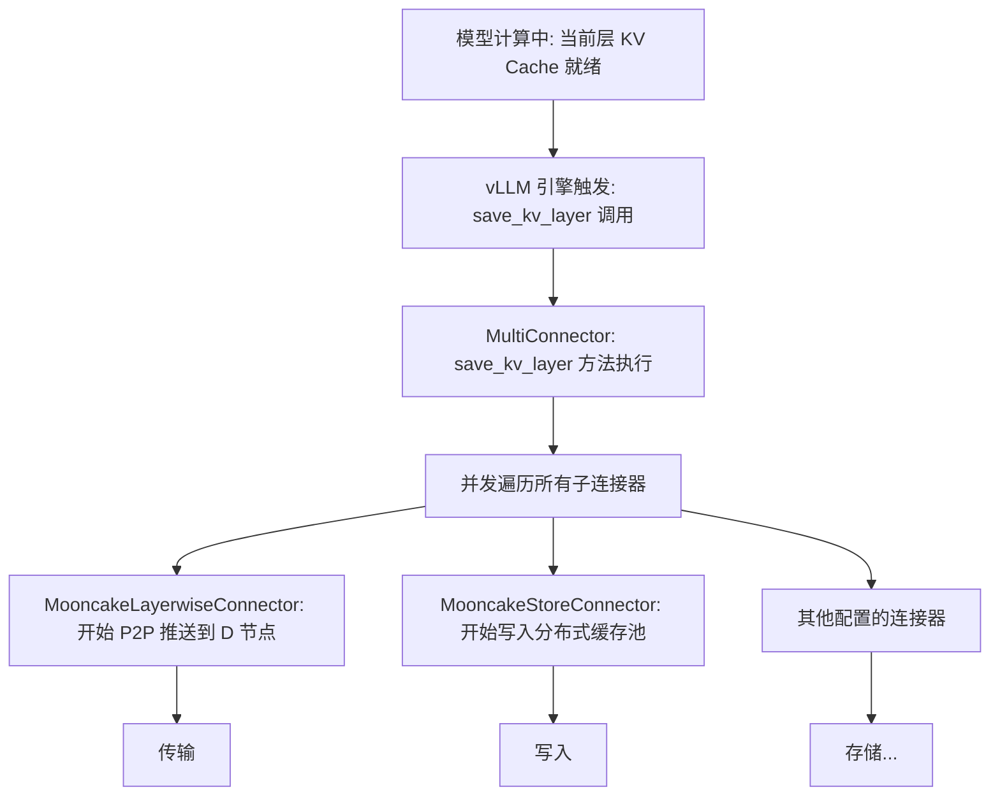

# Mooncake KV Cache Pool 与 PD 分离结合调研

## 1. 概述

通过 `MultiConnector` 的组合，vLLM Ascend 能够同时利用**KV Cache Pool**（基于 MooncakeStore 的分布式缓存）与 **Mooncake PD 分离**（Prefill-Decode 解耦）：

1. **Mooncake P2P Connector**：实现 Prefill 到 Decode 节点的高速直传，降低 Decode 节点的启动延迟。
2. **AscendStoreConnector**：实现 KV Cache 存储在分布式池中，支持跨会话、跨实例的前缀缓存复用。

这种设计既保证了 PD 分离架构下的低延迟传输，又通过 KV Pool 提升了长前缀场景的缓存命中率，同时利用 Layerwise 机制有效控制了显存占用。

## 2. 架构流程

`MultiConnector` 将当前层的 KV Cache 分发给所有注册的子连接器，流程如下图所示：



## 3. 核心机制分析

### 3.1 Connector初始化

vLLM 引擎启动时，会根据配置动态加载并初始化connector。

1）用户可以根据实际需求单独使用某个 connector 配置，例如

```json
"kv_connector": "AscendStoreConnector"
```

2）可以通过 `MultiConnector` 配置多个connector。例如：（参考[PR #17564 [V1] Support multiple kv connectors - SemanticDiff](https://app.semanticdiff.com/gh/vllm-project/vllm/pull/17564/overview#:~:text=We%20take%20advantage%20of%20the%20kv_connector_extra_config%3A%20dict%5Bstr%2C%20Any%5D,we%20want%20in%20an%20ordered%20list%20of%20kwargs.)）

```json
{
  "kv_connector": "MultiConnector",
  "kv_role": "kv_both",
  "kv_connector_extra_config": {
    "connectors": [
      {
        "kv_connector": "NixlConnector",
        "kv_role": "kv_both"
      },
      {
        "kv_connector": "SharedStorageConnector",
        "kv_role": "kv_both",
        "kv_connector_extra_config": {
          "shared_storage_path": "local_storage"
        }
      }
    ]
  }
}
```

vLLM 中，`MultiConnector` 会根据配置列表递归实例化所有子 Connector。

**核心代码走读 (vLLM)**：

```python
# vllm/distributed/kv_transfer/kv_connector/v1/multi_connector.py

class MultiConnector(KVConnectorBase_V1):
    def __init__(
        self, 
        vllm_config: "VllmConfig", 
        role: KVConnectorRole, 
        kv_cache_config: "KVCacheConfig",
    ):
        super().__init__(vllm_config, role, kv_cache_config)

        self._connectors: list[KVConnectorBase_V1] = []
        # 核心点：从 kv_connector_extra_config 中读取子连接器配置列表，利用工厂模式递归实例化每个子 Connector
        for connector_cls, temp_config in self._get_connector_classes_and_configs(
            vllm_config
        ):
            self._connectors.append(connector_cls(temp_config, role, kv_cache_config))
            self._ktc_kv_transfer_config.append(temp_config.kv_transfer_config)

```

### 3.2 AscendStoreConnector 的角色

`AscendStoreConnector` 专门负责与 KV Cache Pool (MooncakeStore) 进行交互，处理 KV 的持久化和检索。它在 `vllm-ascend` 的 `__init__.py` 中被注册，并在初始化时根据配置决定是否启用 Layerwise 模式。

**核心代码走读**：

```python
# vllm_ascend/distributed/kv_transfer/kv_pool/ascend_store/ascend_store_connector.py

class AscendStoreConnector(KVConnectorBase_V1):
    def __init__(self, vllm_config: VllmConfig, role: KVConnectorRole, kv_cache_config: KVCacheConfig | None = None):
        super().__init__(vllm_config=vllm_config, role=role, kv_cache_config=kv_cache_config)

        # 核心点：读取用户配置，决定是否启用 layerwise 模式
        # layerwise 模式允许逐层处理 KV，减少显存峰值并支持异步传输
        self.use_layerwise = vllm_config.kv_transfer_config.kv_connector_extra_config.get("use_layerwise", False)

        if role == KVConnectorRole.SCHEDULER:
            # Scheduler 端负责元数据管理和查找逻辑
            self.connector_scheduler = KVPoolScheduler(vllm_config, self.use_layerwise)
        else:
            # Worker 端负责实际的数据传输和线程管理
            self.connector_worker = KVPoolWorker(vllm_config, self.use_layerwise)
```

### 3.3 KVPoolWorker 的线程模型

KVPoolWorker根据 `use_layerwise` 配置，创建不同的后台线程来处理 KV 的发送和接收。Layerwise 模式下的线程能够配合模型计算逐层搬运数据。

**核心代码走读**：

```python
# vllm_ascend/distributed/kv_transfer/kv_pool/ascend_store/pool_worker.py

class KVPoolWorker:
    def register_kv_caches(self, kv_caches: dict[str, torch.Tensor]):
        # ... 省略其他初始化代码 ...

        if self.use_layerwise:
            # 核心点：Layerwise 模式下，使用KVCacheStoreLayerSendingThread/KVCacheStoreLayerRecvingThread 线程
            # 支持逐层异步传输，避免阻塞模型计算

            if self.kv_role in ["kv_producer", "kv_both"]:
                ready_event_sending = threading.Event()
                self.kv_send_thread = KVCacheStoreLayerSendingThread(
                    self.m_store,
                    self.token_database,
                    # ... 其他参数 ...
                    self.num_layers, # 传递层数以便线程知道何时结束
                )
                self.kv_send_thread.start()

            ready_event = threading.Event()
            self.kv_recv_thread = KVCacheStoreLayerRecvingThread(
                self.m_store,
                self.token_database,
                # ... 其他参数 ...
                self.get_event, # 用于层间同步的事件
            )
            self.kv_recv_thread.start()

        else:
            # 非Layerwise 模式使用普通线程处理整块数据
            # ...
```
