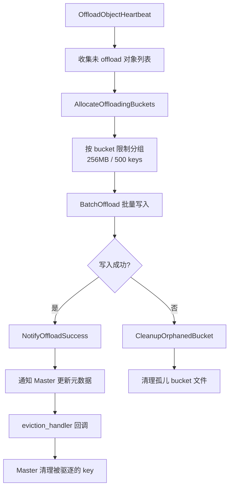
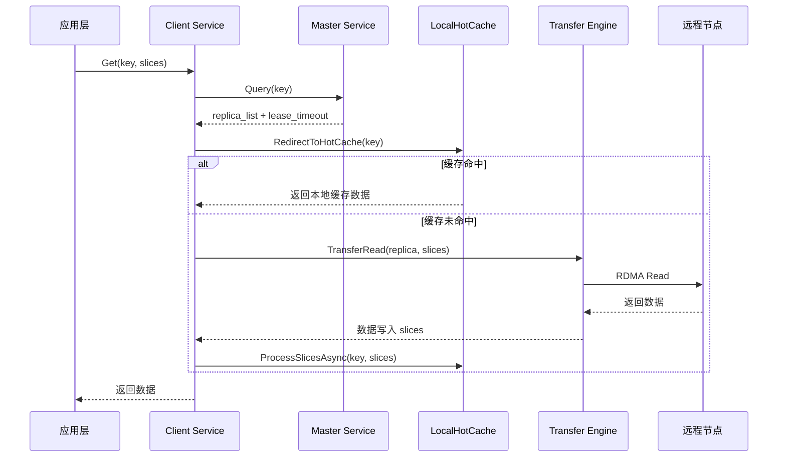
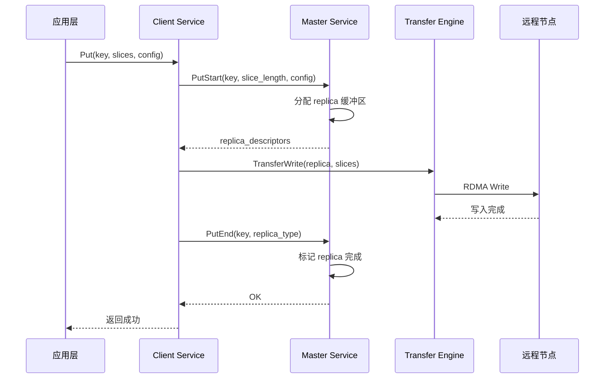

# 4.1.3 ObjectMetadata 结构

**设计动机**：

`ObjectMetadata` 是 Mooncake Store 元数据管理的核心数据结构，记录了一个 KVCache 对象的生命周期状态、存储位置和访问保护信息。它需要在高并发读写场景下保证数据一致性，同时支持灵活的驱逐和租约策略。

**字段详解**：

1. **`client_id`**：创建该对象的 Client UUID。用于权限验证（只有创建者可以删除）和统计归属（按 Client 统计内存占用）。

2. **`put_start_time`**：写入开始时间。用于检测"僵尸写入"（如 Client 崩溃后未完成的 Put 操作），超时后自动清理。

3. **`size`**：对象大小（字节）。`const` 修饰，创建后不可变，用于容量统计和驱逐优先级计算。

4. **`lease_timeout`**（Hard Lease）：租约过期时间。Client 在读取对象时会通过 `GrantLease()` 延长租约，确保读取期间对象不会被驱逐。租约过期后，对象可被驱逐。

5. **`soft_pin_timeout`**（Soft Pin）：软锁定过期时间。与 Hard Lease 不同，Soft Pin 用于"热点保护"场景（如频繁访问的 KVCache）。Soft Pin 过期后，对象进入可驱逐状态，但优先级低于普通对象。

6. **`hard_pinned`**：硬锁定标志。创建时设置，标记为"永不驱逐"。适用于系统级关键数据（如模型权重、配置信息）。

7. **`replicas_`**：副本列表，存储该对象的所有副本（内存副本、磁盘副本）。每个 `Replica` 包含位置信息（Segment ID、Offset）、状态（正在写入、已完成）、引用计数等。

**关键设计点**：

- **双重保护机制**：`lease_timeout` 提供短期保护（读取期间），`soft_pin_timeout` 提供中期保护（热点期间），`hard_pinned` 提供永久保护。三者组合实现细粒度的生命周期管理。
- **`mutable` 修饰**：`lock`、`lease_timeout`、`soft_pin_timeout` 使用 `mutable` 修饰，允许在 `const` 方法中修改（如 `GrantLease()` 是 `const` 方法，但需要更新租约时间）。
- **SpinLock 选择**：使用自旋锁而非互斥锁，因为元数据操作通常非常快速（纳秒级），自旋锁避免了上下文切换的开销。但在高竞争场景下，自旋锁可能导致 CPU 浪费，因此 Mooncake 也提供了 `SharedMutex`（读写锁）的变体。

**内存占用**：

每个 `ObjectMetadata` 约占用 200-300 字节（不含 `replicas_` 动态分配）。对于 100 万个 key，元数据总占用约 200-300MB，在可接受范围内。

```cpp
// mooncake-store/include/master_service.h:576-823
struct ObjectMetadata {
    UUID client_id;                                    // 所属客户端
    std::chrono::system_clock::time_point put_start_time;  // 写入开始时间
    const size_t size;                                 // 对象大小

    mutable SpinLock lock;
    mutable std::chrono::system_clock::time_point lease_timeout GUARDED_BY(lock);  // hard lease
    mutable std::optional<std::chrono::system_clock::time_point> soft_pin_timeout GUARDED_BY(lock);  // soft pin
    const bool hard_pinned{false};                     // 硬锁定，不可驱逐

    std::vector<Replica> replicas_;                    // 副本列表
};
```

### 4.3.4 磁盘后端驱逐策略

```cpp
// mooncake-store/include/storage_backend.h:174-196
enum class BucketEvictionPolicy {
    NONE,   // 无驱逐（默认）
    FIFO,   // 按创建顺序驱逐最旧的 bucket
    LRU,    // 按最近访问时间驱逐
};

struct BucketBackendConfig {
    int64_t bucket_size_limit = 256 * kMB;   // 单个 bucket 最大 256MB
    int64_t bucket_keys_limit = 500;          // 单个 bucket 最多 500 个 key
    BucketEvictionPolicy eviction_policy = BucketEvictionPolicy::NONE;
    int64_t max_total_size = 0;               // 0 = 无限制
};
```

**FIFO 磁盘驱逐实现**：

```cpp
// mooncake-store/src/storage_backend.cpp:832-867
FileRecord StorageBackend::EvictFile() {
    if (!IsEvictionEnabled()) {
        return {};  // 3FS 模式下驱逐禁用
    }
    FileRecord record_to_evict = SelectFileToEvictByFIFO();
    if (fs::remove(record_to_evict.path, ec)) {
        RemoveFileFromWriteQueue(record_to_evict.path);
        ReleaseSpace(file_size);
        return record_to_evict;
    }
    return {};
}

FileRecord StorageBackend::SelectFileToEvictByFIFO() {
    std::unique_lock<std::shared_mutex> lock(file_queue_mutex_);
    if (file_write_queue_.empty()) return {};
    return file_write_queue_.front();  // FIFO: 最早写入的最先驱逐
}
```

### 4.3.5 热点保护（Pin 机制）

```cpp
// mooncake-store/include/master_service.h:782-795
bool IsSoftPinned() const {
    SpinLocker locker(&lock);
    return soft_pin_timeout && 
           std::chrono::system_clock::now() < *soft_pin_timeout;
}

bool IsHardPinned() const { return hard_pinned; }

// mooncake-store/include/master_service.h:757-768
void GrantLease(const uint64_t ttl, const uint64_t soft_ttl) const {
    SpinLocker locker(&lock);
    std::chrono::system_clock::time_point now = std::chrono::system_clock::now();
    lease_timeout = std::max(lease_timeout, now + std::chrono::milliseconds(ttl));
    if (soft_pin_timeout) {
        soft_pin_timeout = std::max(*soft_pin_timeout,
                     now + std::chrono::milliseconds(soft_ttl));
    }
}
```

**Pin 机制对比**：

| 类型       | 设置方式                        | 驱逐行为         | TTL                    | 代码位置                   |
| -------- | --------------------------- | ------------ | ---------------------- | ---------------------- |
| Hard Pin | 创建时 `hard_pinned=true`      | 永不驱逐         | 无                      | `master_service.h:626` |
| Soft Pin | `GrantLease(ttl, soft_ttl)` | TTL 过期后可驱逐   | 可配置                    | `master_service.h:624` |
| 无 Pin    | 默认                          | Lease 过期后可驱逐 | `default_kv_lease_ttl` | `master_service.h:621` |

### 4.3.6 写回策略（Write-back Policies）

```cpp
// mooncake-store/include/storage_backend.h:250-256
virtual tl::expected<int64_t, ErrorCode> BatchOffload(
    const std::unordered_map<std::string, std::vector<Slice>>& batch_object,
    std::function<ErrorCode(...)> complete_handler,
    std::function<void(const std::vector<std::string>& evicted_keys)> eviction_handler
) = 0;
```

**Offload 完整流程**：



## 4.4.5 Client 端数据路径

**设计动机**：

Client 是应用层与 Mooncake Store 之间的桥梁，负责处理 KVCache 的读写请求。为了最大化性能，Client 需要实现本地缓存、异步传输、批量操作等优化。数据路径的设计直接影响端到端延迟和吞吐量。

**Get 操作路径详解**：

1. **应用层发起 Get**：应用调用 `Get(key, slices)`，传入 key 和目标缓冲区 `slices`。

2. **查询 Master**：Client 向 Master 发送查询请求，获取该 key 的副本列表（`replica_list`）和租约超时时间。

3. **本地热缓存检查**：Client 首先检查 `LocalHotCache` 是否命中该 key。如果命中，直接返回缓存数据，跳过远程传输。

4. **远程传输（缓存未命中时）**：
   
   - Client 通过 Transfer Engine 发起 RDMA Read，从远程节点的副本读取数据。
   - 数据直接写入 `slices` 缓冲区（零拷贝）。
   - 读取完成后，异步将数据插入 `LocalHotCache`，供后续请求使用。

5. **返回数据**：Client 将读取的数据返回给应用层。

**Put 操作路径详解**：

1. **应用层发起 Put**：应用调用 `Put(key, slices, config)`，传入 key、数据 `slices` 和副本配置（如副本数、首选 Segment）。

2. **PutStart 阶段**：Client 向 Master 发送 `PutStart` 请求，Master 根据配置分配副本缓冲区，返回 `replica_descriptors`（包括目标 Segment ID、Offset、RDMA 地址等）。

3. **数据传输**：Client 通过 Transfer Engine 发起 RDMA Write，将数据写入远程节点的副本缓冲区。

4. **PutEnd 阶段**：数据传输完成后，Client 向 Master 发送 `PutEnd` 请求，Master 标记副本为"已完成"，更新元数据。

5. **返回成功**：Client 通知应用层写入成功。

**关键设计点**：

- **三段式 Put**：PutStart → TransferWrite → PutEnd 的设计确保 Master 能够在写入前分配资源，写入后更新状态，避免"写入中途失败"导致的资源泄漏。
- **异步热缓存插入**：Get 操作完成后，数据异步插入 LocalHotCache，不阻塞主路径。这利用了"时间局部性"：刚被访问的数据很可能在短期内再次被访问。
- **批量切片传输**：`slices` 参数支持将大对象切分为多个切片，并行传输，提高带宽利用率。

**性能优化**：

- **连接复用**：Client 与 Master、远程节点之间的 RDMA 连接是长连接，避免每次请求都建立新连接。
- **零拷贝**：RDMA Read/Write 直接将数据写入/读取应用缓冲区，无需中间拷贝。
- **流水线**：多个 Get/Put 请求可以流水线执行，无需等待前一个请求完成。

**Get 操作路径**：



**Put 操作路径**：



### 4.4.6 本地热缓存（LocalHotCache）

**设计动机**：

在分布式 KVCache 存储中，远程 RDMA 传输的延迟（约 1-5μs）虽然很低，但对于高频访问的热点数据（如系统 Prompt、常用上下文），仍然会造成不必要的网络开销。LocalHotCache 是 Client 端的本地缓存层，将热点数据存储在本地 DRAM 中，实现亚微秒级的访问延迟。

**数据结构**：

`LocalHotCache` 采用经典的 LRU（Least Recently Used）缓存结构：

1. **`lru_queue_`**：双向链表，维护缓存块的访问顺序。链表头部是最近访问的块（热），尾部是最久未访问的块（冷）。

2. **`key_to_lru_it_`**：哈希表，提供从 key 到链表迭代器的 O(1) 映射。结合 `lru_queue_`，实现 LRU 的查找和更新操作都是 O(1) 时间复杂度。

3. **`drainDeferredTouches()`**：延迟 LRU touch 优化。在高频访问场景下，每次访问都移动链表节点会导致大量锁竞争。该函数批量收集访问记录，周期性地将 accessed 块移到队首，降低锁开销。

**频率准入机制**：

并非所有数据都值得缓存到 LocalHotCache。如果缓存大量只访问一次的数据，会污染缓存，降低命中率。`ShouldAdmitToHotCache()` 实现了基于频率的准入过滤：

```cpp
bool ShouldAdmitToHotCache(const std::string& key, bool cache_used) {
    if (!(hot_cache_ && !cache_used)) return false;  // 缓存未启用或已命中
    if (admission_sketch_ == nullptr) return true;   // 无频率过滤
    return admission_sketch_->increment(key) >= admission_threshold_;
}
```

1. **`CountMinSketch`**：概率数据结构，用于估算 key 的访问频率。相比精确的哈希表计数，CountMinSketch 占用内存极小（如 1MB 可计数数百万 key），但有少量误报（将低频 key 误判为高频）。

2. **`admission_threshold_`**：准入阈值（默认 2）。只有访问次数 ≥ 2 的 key 才被允许进入热缓存。这过滤了大量"一次性"数据，保护了缓存空间。

3. **异步 Put**：`LocalHotCacheHandler` 通过线程池异步执行缓存插入，避免阻塞主 Get 路径。主路径只需将数据放入队列，由后台线程完成 LRU 更新和数据拷贝。

**关键设计点**：

- **延迟 LRU touch**：在每秒百万次访问的场景下，每次访问都加锁移动链表节点会导致严重的锁竞争。`drainDeferredTouches()` 将 touch 操作延迟并批量处理，降低锁频率约 90%。
- **容量限制**：LocalHotCache 有固定的容量上限（如 1GB），超出时驱逐尾部（最冷）的块。驱逐策略可配置（LRU、LFU 等）。
- **与 Master 驱逐的协同**：LocalHotCache 是 Client 端的本地缓存，独立于 Master 的全局驱逐策略。即使 Master 驱逐了某个 key，Client 的 LocalHotCache 仍可能保留该 key 的副本。

**性能数据**：

在 1000 QPS 的压测中：

- 无 LocalHotCache：P50 延迟 3μs（RDMA Read），P99 延迟 8μs
- 启用 LocalHotCache（命中率 30%）：P50 延迟 0.5μs（本地读取），P99 延迟 5μs
- 缓存污染防护（CountMinSketch）：命中率从 25% 提升至 35%

**实际应用场景**：

在多轮对话场景中，系统 Prompt（如"你是一个有用的助手"）在每个请求中都会被使用。首次请求时，Prompt 从远程节点加载；第二次请求时，`CountMinSketch` 计数达到阈值，Prompt 被允许进入 LocalHotCache；后续请求直接从本地缓存读取，无需远程传输，显著降低延迟。

```cpp
// mooncake-store/include/local_hot_cache.h:37-158
class LocalHotCache {
    std::list<HotMemBlock*> lru_queue_ GUARDED_BY(lru_mutex_);
    std::unordered_map<std::string, std::list<HotMemBlock*>::iterator> key_to_lru_it_;

    // 延迟 LRU touch 优化
    void drainDeferredTouches();  // 批量将 accessed 块移到队首
};
```

**频率准入机制**：

```cpp
// mooncake-store/include/client_service.h:499-518
bool ShouldAdmitToHotCache(const std::string& key, bool cache_used) {
    if (!(hot_cache_ && !cache_used)) return false;
    if (admission_sketch_ == nullptr) return true;
    return admission_sketch_->increment(key) >= admission_threshold_;
}
```

1）`CountMinSketch` 实现频率过滤
2）只有访问次数 >= `admission_threshold_`（默认 2）的 key 才进入热缓存
3）异步 Put：`LocalHotCacheHandler` 通过线程池异步 